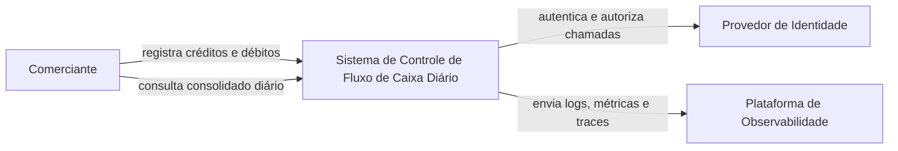
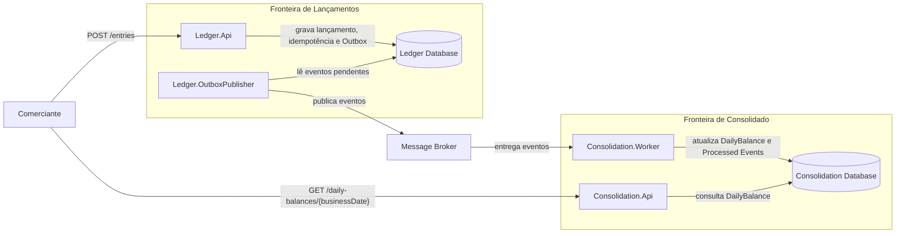
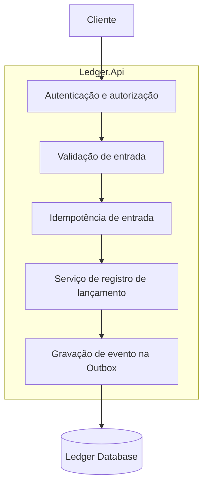
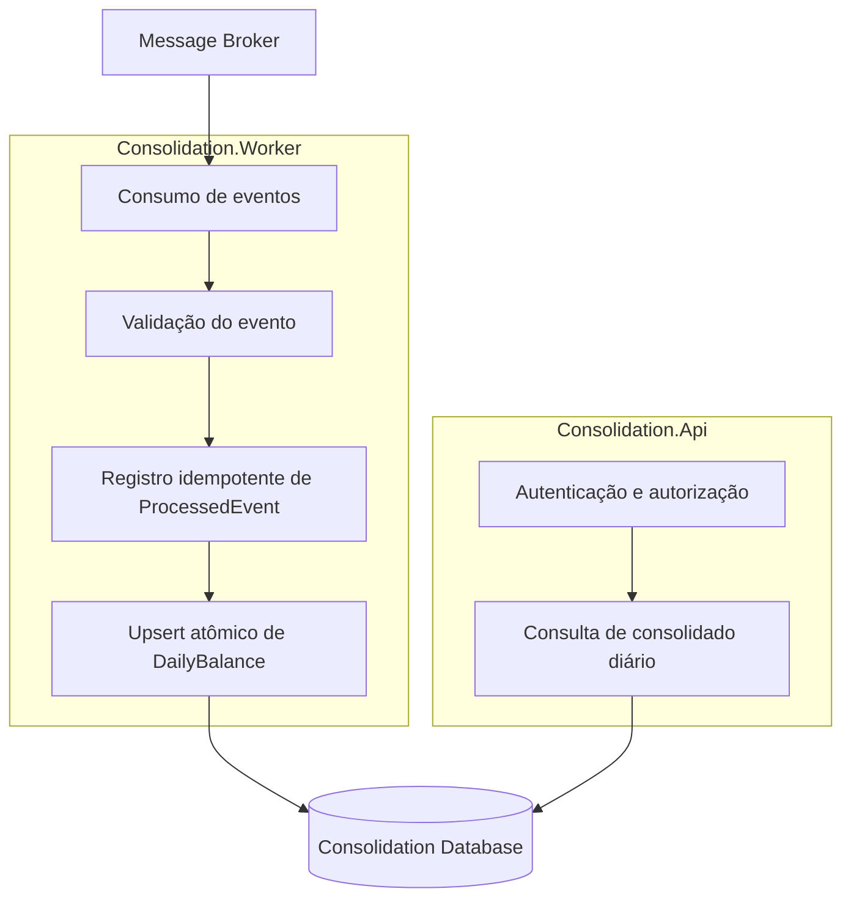
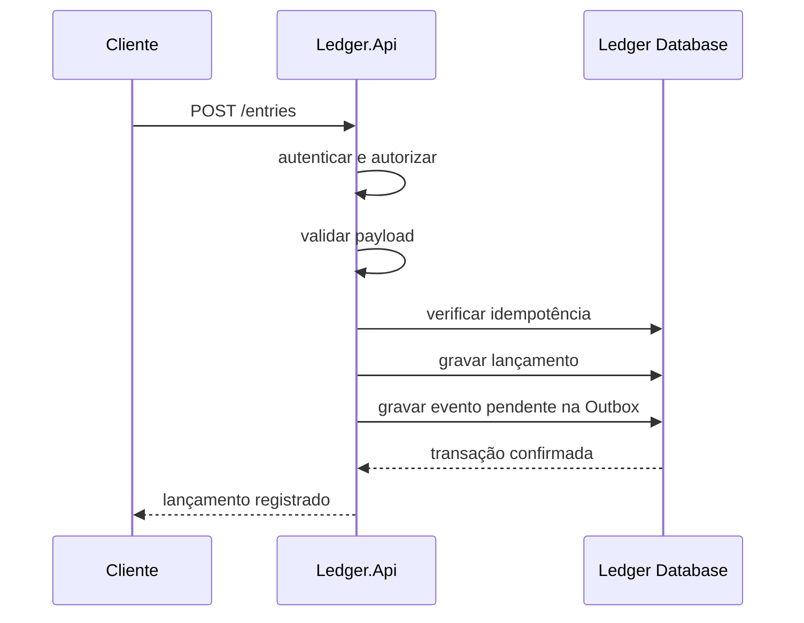
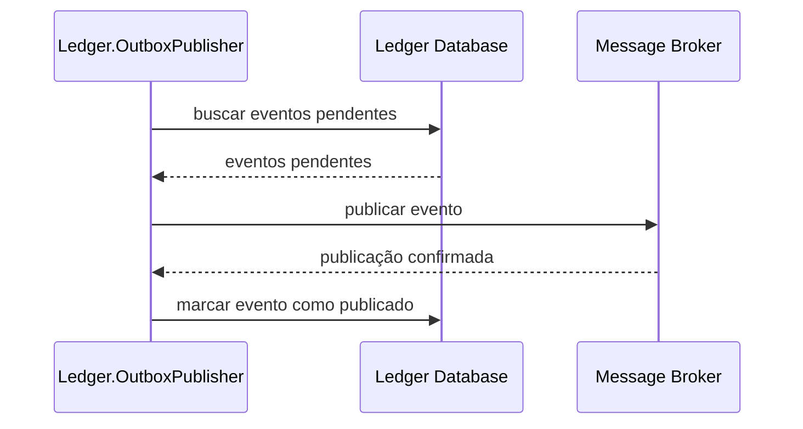
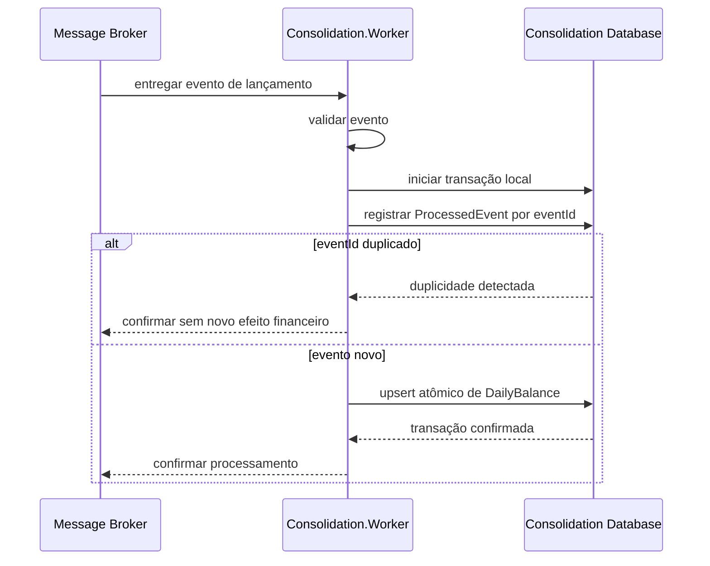
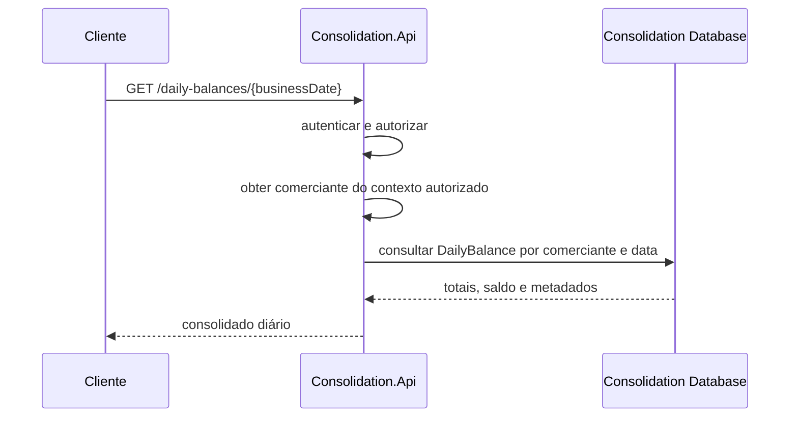
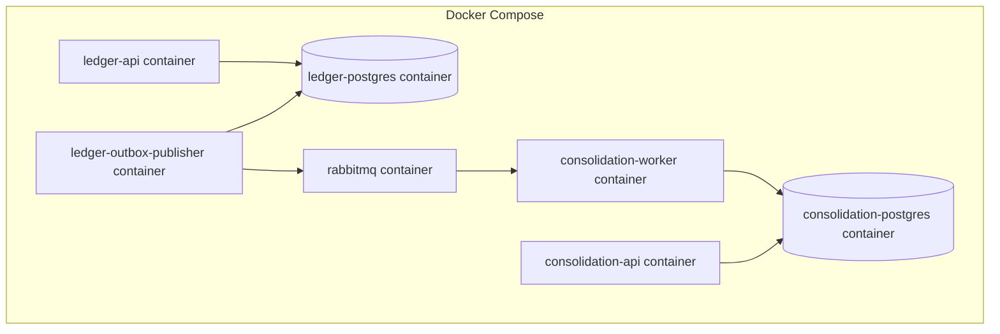

# Diagramas

## 1. Objetivo

Este documento apresenta os diagramas arquiteturais da solução para controle de lançamentos e consulta do consolidado diário.

Os diagramas refletem a arquitetura descrita em `05-arquitetura-da-solucao.md` e as decisões registradas em `docs/decisions/`.

A documentação utiliza uma representação compatível com a leitura do C4 Model, cobrindo contexto, containers, componentes principais e fluxos arquiteturais.

---

## 2. Notas de leitura

Os diagramas usam Mermaid para facilitar visualização em ferramentas compatíveis com Markdown.

Os níveis seguem esta intenção:

```text
- Contexto: mostra o sistema e seus atores externos.
- Container: mostra APIs, workers, bancos e broker.
- Componentes: mostra responsabilidades internas relevantes.
- Fluxos: mostra sequências de comportamento da solução.
```

---

## 3. C4 Context — Visão de contexto



Neste nível, o sistema permite ao comerciante registrar lançamentos financeiros e consultar o consolidado diário.

O provedor de identidade e a plataforma de observabilidade representam capacidades externas ou corporativas que podem variar conforme o ambiente.

---

## 4. C4 Container — Visão de containers



Esta visão mostra as quatro unidades implantáveis principais, as duas persistências independentes e o broker assíncrono.

---

## 5. Componentes — Lançamentos



A fronteira de Lançamentos concentra a escrita financeira e garante que o lançamento e a intenção de publicação sejam persistidos de forma consistente.

---

## 6. Componentes — Consolidado



A fronteira de Consolidado separa processamento assíncrono e consulta de leitura, mantendo a projeção materializada como visão derivada.

---

## 7. Fluxo — Registro de lançamento



Esse fluxo mantém o registro financeiro dentro da fronteira de Lançamentos e não depende do Consolidado.

---

## 8. Fluxo — Publicação via Outbox



Esse fluxo torna a publicação recuperável e evita perda silenciosa entre persistência e envio ao broker.

---

## 9. Fluxo — Consolidação



Esse fluxo materializa consumo at-least-once com processamento idempotente. `ProcessedEvent` e `DailyBalance` são tratados na mesma transação local; duplicidade concorrente de `eventId` não reaplica saldo.

---

## 10. Fluxo — Consulta do consolidado



Esse fluxo atende a consulta do relatório diário sem recalcular o saldo a partir de todos os lançamentos em cada requisição.

---

## 11. Visão operacional local



Esta visão representa a execução local do desafio.

Docker Compose não representa a topologia definitiva de produção. Ele materializa uma forma reproduzível para avaliação, testes e validação dos fluxos principais.

---

## 12. Relação com ADRs

| Diagrama | ADRs relacionados |
|---|---|
| C4 Context | ADR-0010 |
| C4 Container | ADR-0001, ADR-0005, ADR-0007, ADR-0008, ADR-0010 |
| Componentes de Lançamentos | ADR-0002, ADR-0005, ADR-0006, ADR-0008, ADR-0009 |
| Componentes de Consolidado | ADR-0003, ADR-0004, ADR-0005, ADR-0006, ADR-0008, ADR-0009 |
| Registro de lançamento | ADR-0001, ADR-0002, ADR-0005, ADR-0006 |
| Publicação via Outbox | ADR-0002, ADR-0007 |
| Consolidação | ADR-0003, ADR-0004, ADR-0007 |
| Consulta do consolidado | ADR-0000, ADR-0004 |
| Visão operacional local | ADR-0008, ADR-0009, ADR-0010 |

---

## 13. Relação com documentos

Este documento complementa:

```text
- 03-blocos-de-arquitetura.md
- 04-blocos-de-solucao.md
- 05-arquitetura-da-solucao.md
- docs/decisions/
```

Os aspectos de segurança e operação serão aprofundados em:

```text
- docs/security/arquitetura-de-seguranca.md
- docs/operations/arquitetura-operacional.md
- docs/operations/observabilidade-sli-slo-e-recuperacao.md
```

---

## 14. Status

Documento atualizado como baseline de diagramas para a implementação local e visão operacional documentada.
