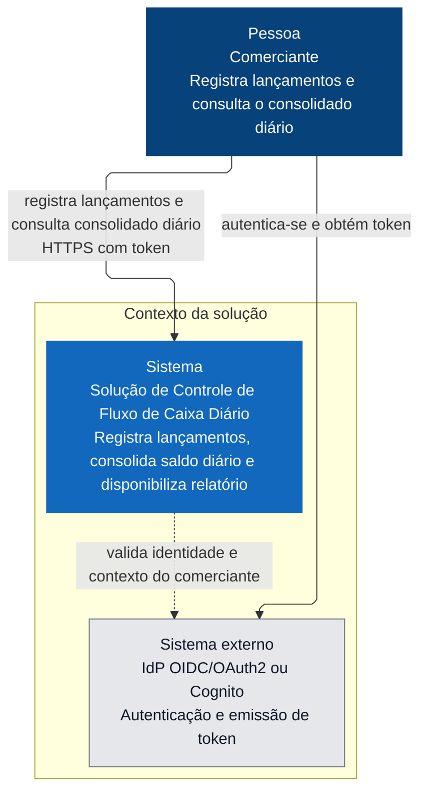
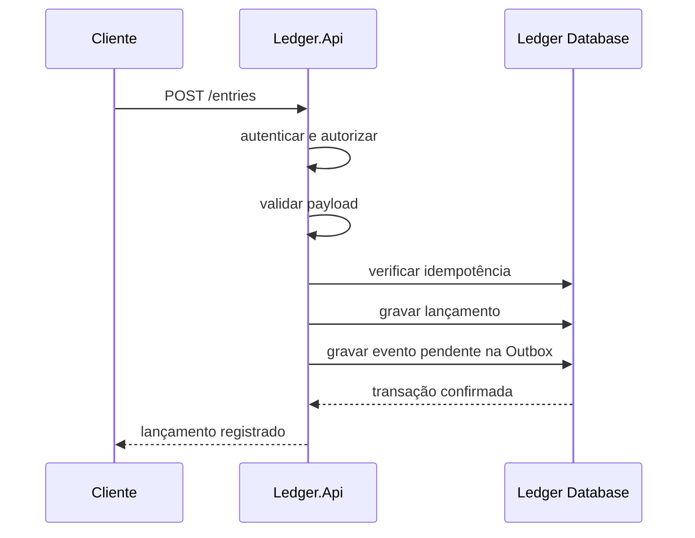
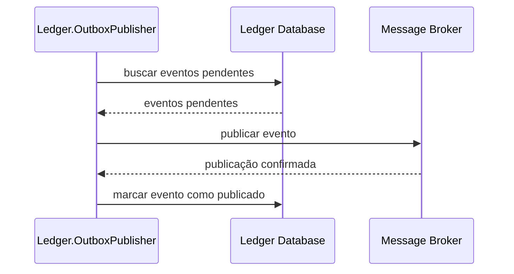
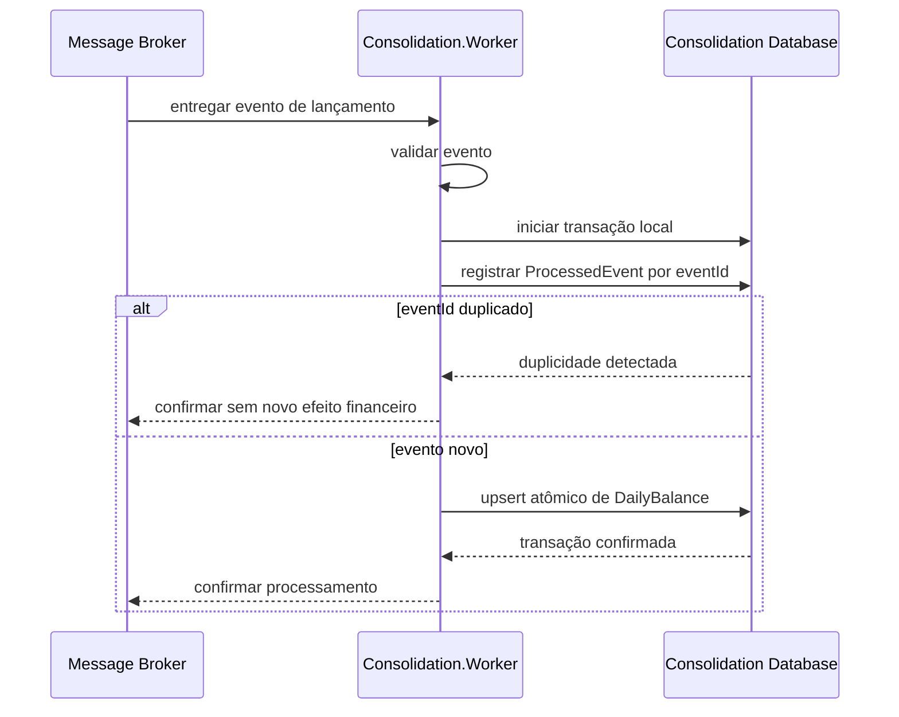
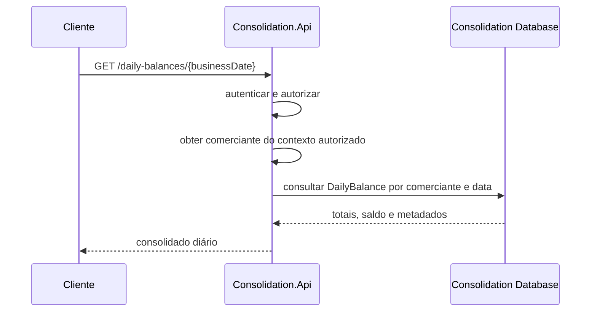
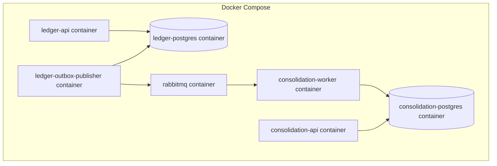

# Diagramas

## 1. Objetivo

Este documento apresenta os diagramas arquiteturais da solução para controle de lançamentos e consulta do consolidado diário.

Os diagramas refletem a arquitetura descrita em `05-arquitetura-da-solucao.md` e as decisões registradas em `docs/decisions/`.

A documentação utiliza uma representação compatível com a leitura do C4 Model, cobrindo contexto, containers, componentes principais e fluxos arquiteturais.

---

## 2. Notas de leitura

Os diagramas usam Mermaid para facilitar visualização em ferramentas compatíveis com Markdown.

Os níveis seguem esta intenção:

```text
- Contexto: mostra o sistema e seus atores externos.
- Container: mostra APIs, workers, bancos e broker.
- Componentes: mostra responsabilidades internas relevantes.
- Fluxos: mostra sequências de comportamento da solução.
```

---

## 3. C4 Context: Visão de contexto

[📐 Abrir no Mermaid](https://mermaid.ai/d/34b1243e-8029-4a1b-9c15-a35198475d7b)



Esta visão mostra o sistema no nível de contexto. O comerciante é o ator principal, a solução de controle de fluxo de caixa diário é o sistema em foco e o IdP OIDC/OAuth2 ou Cognito representa a dependência externa de identidade.

Neste nível não são exibidos containers, banco de dados, filas, cloud, subnets, workers ou detalhes de implantação. Esses elementos aparecem no diagrama de container.

---

## 4. C4 Container: Topologia AWS de referência

[📐 Abrir no Mermaid](https://mermaid.ai/d/4de7eb6f-2554-4b1a-aaa4-93dd0f18a909)

```mermaid
---
config:
  layout: elk
  flowchart:
    curve: linear
    nodeSpacing: 80
    rankSpacing: 110
---
flowchart TB
    subgraph external["Atores e sistemas externos"]
        direction LR
        client["Pessoa<br/>Cliente / Comerciante"]
        idp["Sistema externo<br/>IdP OIDC/OAuth2 ou Cognito"]
    end

    subgraph aws["AWS como referência do case"]
        direction TB

        subgraph edge["Entrada e governança de APIs"]
            direction TB
            waf["AWS WAF Web ACL<br/>associado ao API Gateway"]
            apiGateway["API Gateway<br/>gateway de APIs<br/>rotas, políticas e controle de entrada"]
        end

        subgraph solution["Sistema: Solução Banco Carrefour"]
            direction TB

            subgraph vpc["VPC"]
                direction LR

                subgraph leftNetworkColumn["Rede de suporte"]
                    direction TB
                    networkSpacer[" "]
                    publicSubnets["Subnets públicas multi-AZ<br/><br/>NAT Gateway opcional<br/>ou VPC endpoints conforme<br/>desenho de rede"]
                end

                subgraph privateRuntimeColumn["Runtime privado"]
                    direction TB

                    subgraph appSubnets["Subnets privadas de aplicação multi-AZ<br/>fronteiras lógicas compartilham a camada de rede"]
                        direction TB

                        vpcLink["VPC Link / Private integration<br/>conecta API Gateway à VPC"]
                        alb["Application Load Balancer interno<br/>roteamento para ECS<br/>target groups tipo ip"]

                        subgraph runtime["Containers da solução em ECS Fargate"]
                            direction LR

                            subgraph consolidationBoundary["Fronteira lógica de Consolidado"]
                                direction TB
                                consolidationApi@{ shape: hex, label: "Container<br/>Consolidation.Api<br/>ECS Fargate service" }
                                consolidationWorker@{ shape: hex, label: "Container<br/>Consolidation.Worker<br/>ECS Fargate task/service" }
                            end

                            subgraph ledgerBoundary["Fronteira lógica de Lançamentos"]
                                direction TB
                                ledgerApi@{ shape: hex, label: "Container<br/>Ledger.Api<br/>ECS Fargate service" }
                                outboxPublisher@{ shape: hex, label: "Container<br/>Ledger.OutboxPublisher<br/>ECS Fargate task/service" }
                            end
                        end
                    end

                    subgraph dataSubnets["Subnets privadas de dados<br/>DB subnet group multi-AZ"]
                        direction LR
                        consolidationRds[("Data store gerenciado<br/>RDS PostgreSQL - Consolidation")]
                        ledgerRds[("Data store gerenciado<br/>RDS PostgreSQL - Ledger")]
                    end
                end
            end

            subgraph messaging["Serviços gerenciados AWS fora das subnets"]
                direction TB
                sqs@{ shape: h-cyl, label: "SQS Standard<br/>EntryCreated.v1" }
                dlq@{ shape: h-cyl, label: "SQS DLQ<br/>mensagens não processadas" }
            end

            subgraph crossCutting["Serviços transversais AWS<br/>conexões omitidas para reduzir poluição visual"]
                direction LR
                ecr["ECR<br/>imagens versionadas"]
                secrets["Secrets Manager / SSM<br/>configuração e segredos"]
                kms["KMS<br/>criptografia gerenciada"]
                adot["ADOT / OpenTelemetry Collector"]
                cloudwatch["CloudWatch<br/>Logs / Metrics / Alarms"]
                xray["X-Ray<br/>traces distribuídos"]
            end
        end
    end

    client -.->|"autentica"| idp
    client -->|"HTTPS com token"| apiGateway
    waf -.->|"protege tráfego HTTP"| apiGateway

    apiGateway -->|"private integration"| vpcLink
    vpcLink -->|"encaminha requisições privadas"| alb

    alb -->|"GET /daily-balances"| consolidationApi
    alb -->|"POST /entries"| ledgerApi

    consolidationApi -->|"consulta DailyBalance"| consolidationRds
    consolidationWorker -->|"atualiza DailyBalance e ProcessedEvent"| consolidationRds
    consolidationWorker -->|"ReceiveMessage / long polling"| sqs

    ledgerApi -->|"grava Entry, Idempotency e Outbox"| ledgerRds
    outboxPublisher -->|"lê Outbox"| ledgerRds
    outboxPublisher -->|"SendMessage EntryCreated.v1"| sqs

    sqs -->|"redrive policy<br/>maxReceiveCount excedido"| dlq

    adot --> cloudwatch
    adot --> xray

    networkSpacer ~~~ publicSubnets
    leftNetworkColumn ~~~ privateRuntimeColumn

    style networkSpacer fill:transparent,stroke:transparent,color:transparent

    classDef personNode stroke:#6b7280,fill:#f3f4f6,color:#111827
    classDef externalNode stroke:#6b7280,fill:#e5e7eb,color:#111827
    classDef internalNode stroke:#1168bd,fill:#438dd5,color:#ffffff
    classDef containerNode stroke:#1168bd,fill:#438dd5,color:#ffffff
    classDef dataNode stroke:#1168bd,fill:#85bbf0,color:#111827
    classDef queueNode stroke:#1168bd,fill:#85bbf0,color:#111827
    classDef securityNode stroke:#6b7280,fill:#e5e7eb,color:#111827
    classDef transversalNode stroke:#6b7280,fill:#f3f4f6,color:#111827
    classDef boundaryNode stroke:#6b7280,fill:#ffffff,color:#111827

    class client personNode
    class idp externalNode
    class waf securityNode
    class apiGateway,vpcLink,alb,publicSubnets internalNode
    class consolidationApi,consolidationWorker,ledgerApi,outboxPublisher containerNode
    class consolidationRds,ledgerRds dataNode
    class sqs,dlq queueNode
    class ecr,secrets,kms,adot,cloudwatch,xray transversalNode
```



Esta visão mostra a topologia C4 Container da implantação AWS de referência. O API Gateway atua como camada de entrada e governança de APIs. O acesso aos serviços privados ocorre por private integration/VPC Link, encaminhando requisições para um Application Load Balancer interno que distribui tráfego para os serviços ECS Fargate.

As fronteiras de Lançamentos e Consolidado são lógicas e compartilham subnets privadas de aplicação multi-AZ. A separação operacional ocorre por ECS services, target groups, security groups, IAM roles, persistências independentes e fila assíncrona.

SQS é um serviço gerenciado fora das subnets. A relação entre `Consolidation.Worker` e SQS representa leitura por `ReceiveMessage`/long polling. Falhas recorrentes são tratadas por visibility timeout, receive count, redrive policy e DLQ.

KMS, Secrets Manager/SSM, ECR, CloudWatch, X-Ray, ADOT e acesso via NAT Gateway ou VPC endpoints são transversais e foram simplificados para preservar legibilidade.

A visualização não representa fluxo de implantação, CI/CD, publicação de imagens, Terraform, sizing, região, quantidade final de AZs, endpoints privados, política final de subnets ou landing zone real.

---

## 5. Fluxo — Registro de lançamento



Esse fluxo mantém o registro financeiro dentro da fronteira de Lançamentos e não depende do Consolidado.

---

## 6. Fluxo — Publicação via Outbox



Esse fluxo torna a publicação recuperável e evita perda silenciosa entre persistência e envio ao broker.

---

## 7. Fluxo — Consolidação



Esse fluxo materializa consumo at-least-once com processamento idempotente. `ProcessedEvent` e `DailyBalance` são tratados na mesma transação local; duplicidade concorrente de `eventId` não reaplica saldo.

---

## 8. Fluxo — Consulta do consolidado



Esse fluxo atende a consulta do relatório diário sem recalcular o saldo a partir de todos os lançamentos em cada requisição.

---

## 9. Visão operacional local



Esta visão representa a execução local do desafio.

Docker Compose não representa a topologia definitiva de produção. Ele materializa uma forma reproduzível para avaliação, testes e validação dos fluxos principais.

---

## 10. Relação com ADRs

| Diagrama | ADRs relacionados |
|---|---|
| C4 Context | ADR-0010 |
| C4 Container: Topologia AWS de referência | ADR-0001, ADR-0005, ADR-0007, ADR-0008, ADR-0010, ADR-0011, ADR-0012, ADR-0014, ADR-0015 |
| Registro de lançamento | ADR-0001, ADR-0002, ADR-0005, ADR-0006 |
| Publicação via Outbox | ADR-0002, ADR-0007 |
| Consolidação | ADR-0003, ADR-0004, ADR-0007 |
| Consulta do consolidado | ADR-0000, ADR-0004 |
| Visão operacional local | ADR-0008, ADR-0009, ADR-0010 |

---

## 11. Relação com documentos

Este documento complementa:

```text
- 03-blocos-de-arquitetura.md
- 04-blocos-de-solucao.md
- 05-arquitetura-da-solucao.md
- docs/decisions/
```

Os aspectos de segurança e operação serão aprofundados em:

```text
- docs/security/arquitetura-de-seguranca.md
- docs/operations/arquitetura-operacional.md
- docs/operations/observabilidade-sli-slo-e-recuperacao.md
```

---

## 12. Status

Documento atualizado como baseline de diagramas para a implementação local e a implantação AWS de referência do case.
