# Diagramas

## 1. Objetivo

Este documento apresenta os diagramas arquiteturais da solução para controle de lançamentos e consulta do consolidado diário.

Os diagramas refletem a arquitetura descrita em `05-arquitetura-da-solucao.md` e as decisões registradas em `docs/decisions/`, incluindo a topologia de borda (ADR-0008), a plataforma AWS multi-conta (ADR-0011), a promoção/deployment/rollback por workload (ADR-0014) e a governança de migrations (ADR-0015).

A documentação utiliza uma representação compatível com a leitura do C4 Model, cobrindo contexto multi-conta, topologia de containers, visões de implantação por ambiente AWS, fluxos de release/deploy/rollback e visão operacional local.

---

## 2. Notas de leitura

Os diagramas usam Mermaid para facilitar visualização em ferramentas compatíveis com Markdown. Foram revisados manualmente quanto à consistência de nomes/relações com o código e o Terraform reais do repositório - sem dependência de ferramenta externa de validação de DSL.

Os níveis seguem esta intenção:

```text
- Contexto: mostra o sistema, seus atores externos e, na visão multi-conta, as contas AWS envolvidas.
- Container: mostra APIs, workers, bancos, filas, rede e serviços AWS de referência.
- Implantação: mostra a topologia real por ambiente AWS (Development/Staging/Production), com as diferenças de dimensionamento e estratégia de deployment.
- Fluxos: mostra sequências de comportamento da solução e da plataforma (release, deploy, promoção, canary, rollback, migração).
```

---

## 3. C4 Context: Visão de contexto

[📐 Abrir no Mermaid](https://mermaid.ai/d/34b1243e-8029-4a1b-9c15-a35198475d7b)

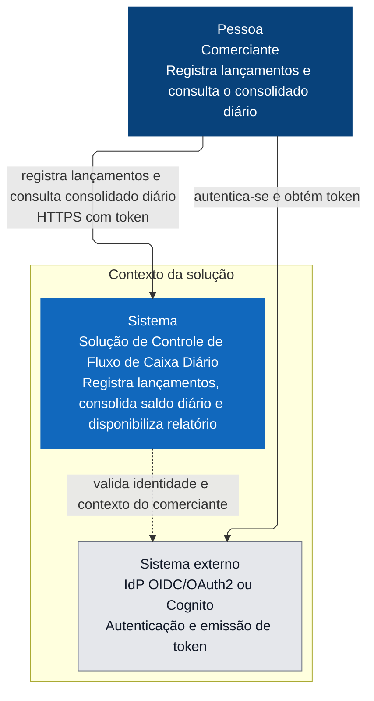
```mermaid
---
config:
  layout: elk
  flowchart:
    curve: linear
    nodeSpacing: 90
    rankSpacing: 100
---
flowchart TB
    comerciante["Pessoa<br/>Comerciante<br/>Registra lançamentos e consulta o consolidado diário"]

    subgraph contexto["Contexto da solução"]
        direction LR
        idp["Sistema externo<br/>IdP OIDC/OAuth2 ou Cognito<br/>Autenticação e emissão de token"]
        solucao["Sistema<br/>Solução de Controle de Fluxo de Caixa Diário<br/>Registra lançamentos, consolida saldo diário e disponibiliza relatório"]
    end

    comerciante -->|"autentica-se e obtém token"| idp
    comerciante -->|"registra lançamentos e consulta consolidado diário<br/>HTTPS com token"| solucao
    solucao -.->|"valida identidade e contexto do comerciante"| idp

    classDef personNode stroke:#08427b,fill:#08427b,color:#ffffff
    classDef internalSystem stroke:#1168bd,fill:#1168bd,color:#ffffff
    classDef externalSystem stroke:#6b7280,fill:#e5e7eb,color:#111827
    classDef boundaryNode stroke:#d1d5db,fill:#ffffff,color:#111827

    class comerciante personNode
    class solucao internalSystem
    class idp externalSystem
```

Esta visão mostra o sistema no nível de contexto. O comerciante é o ator principal, a solução de controle de fluxo de caixa diário é o sistema em foco e o IdP OIDC/OAuth2 ou Cognito representa a dependência externa de identidade.

Neste nível não são exibidos containers, banco de dados, filas, cloud, subnets, workers, contas AWS ou detalhes de implantação. Esses elementos aparecem nos diagramas seguintes.

---

## 4. C4 Context multi-conta: Modelo de contas AWS

Complementa a visão de contexto (seção 3) com a fronteira de contas AWS (ver ADR-0011) - nenhuma landing zone (Organizations/Control Tower) é criada por este repositório; as contas de workload e a conta Artifacts/Tooling são materializadas em `infra/terraform/environments/`, e Security/Log Archive/Network são assumidas como contas compartilhadas já existentes na organização.

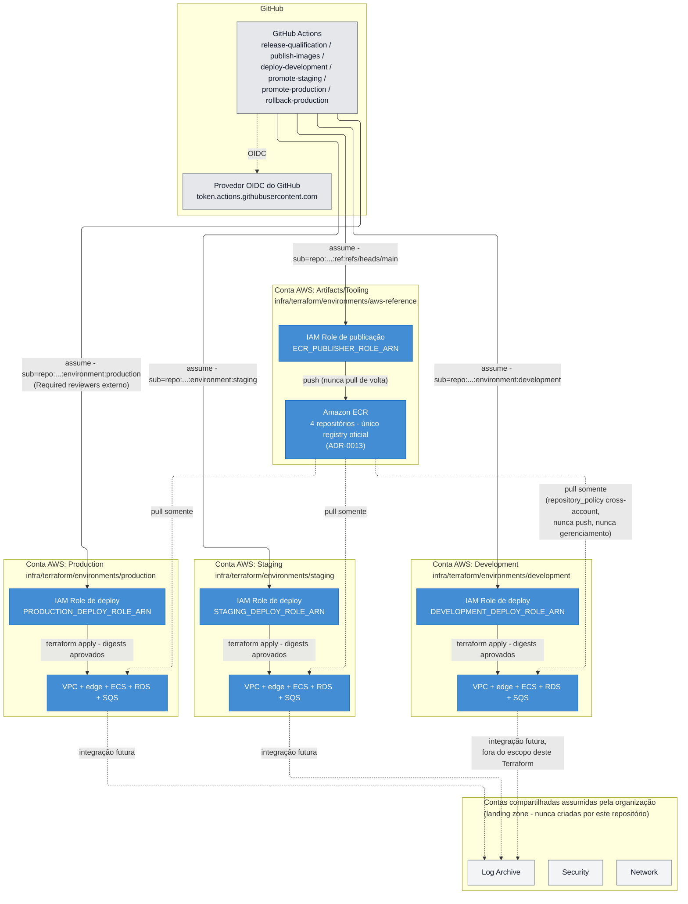
```mermaid
---
config:
  layout: elk
  flowchart:
    curve: linear
    nodeSpacing: 80
    rankSpacing: 100
---
flowchart TB
    subgraph gh["GitHub"]
        direction LR
        actions["GitHub Actions<br/>release-qualification / publish-images /<br/>deploy-development / promote-staging /<br/>promote-production / rollback-production"]
        oidcGh["Provedor OIDC do GitHub<br/>token.actions.githubusercontent.com"]
    end

    subgraph artifacts["Conta AWS: Artifacts/Tooling<br/>infra/terraform/environments/aws-reference"]
        ecr["Amazon ECR<br/>4 repositórios - único registry oficial<br/>(ADR-0013)"]
        publisherRole["IAM Role de publicação<br/>ECR_PUBLISHER_ROLE_ARN"]
    end

    subgraph devAccount["Conta AWS: Development<br/>infra/terraform/environments/development"]
        devStack["VPC + edge + ECS + RDS + SQS"]
        devRole["IAM Role de deploy<br/>DEVELOPMENT_DEPLOY_ROLE_ARN"]
    end

    subgraph stagingAccount["Conta AWS: Staging<br/>infra/terraform/environments/staging"]
        stagingStack["VPC + edge + ECS + RDS + SQS"]
        stagingRole["IAM Role de deploy<br/>STAGING_DEPLOY_ROLE_ARN"]
    end

    subgraph prodAccount["Conta AWS: Production<br/>infra/terraform/environments/production"]
        prodStack["VPC + edge + ECS + RDS + SQS"]
        prodRole["IAM Role de deploy<br/>PRODUCTION_DEPLOY_ROLE_ARN"]
    end

    subgraph sharedAccounts["Contas compartilhadas assumidas pela organização<br/>(landing zone - nunca criadas por este repositório)"]
        direction LR
        security["Security"]
        logArchive["Log Archive"]
        network["Network"]
    end

    actions -.->|"OIDC"| oidcGh
    actions -->|"assume - sub=repo:...:ref:refs/heads/main"| publisherRole
    publisherRole -->|"push (nunca pull de volta)"| ecr

    actions -->|"assume - sub=repo:...:environment:development"| devRole
    actions -->|"assume - sub=repo:...:environment:staging"| stagingRole
    actions -->|"assume - sub=repo:...:environment:production<br/>(Required reviewers externo)"| prodRole

    devRole -->|"terraform apply - digests aprovados"| devStack
    stagingRole -->|"terraform apply - digests aprovados"| stagingStack
    prodRole -->|"terraform apply - digests aprovados"| prodStack

    ecr -.->|"pull somente<br/>(repository_policy cross-account,<br/>nunca push, nunca gerenciamento)"| devStack
    ecr -.->|"pull somente"| stagingStack
    ecr -.->|"pull somente"| prodStack

    devStack -.->|"integração futura,<br/>fora do escopo deste Terraform"| logArchive
    stagingStack -.->|"integração futura"| logArchive
    prodStack -.->|"integração futura"| logArchive

    classDef externalNode stroke:#6b7280,fill:#e5e7eb,color:#111827
    classDef accountNode stroke:#1168bd,fill:#438dd5,color:#ffffff
    classDef sharedNode stroke:#6b7280,fill:#f3f4f6,color:#111827

    class actions,oidcGh externalNode
    class ecr,publisherRole,devStack,devRole,stagingStack,stagingRole,prodStack,prodRole accountNode
    class security,logArchive,network sharedNode
```

Cada conta de workload (Development/Staging/Production) é isolada: nenhum recurso de dado ou runtime é compartilhado entre ambientes. A conta Artifacts/Tooling nunca recebe uma role de deploy de workload, e as roles de deploy de workload nunca têm permissão de push no ECR - apenas pull, via `repository_policy` cross-account (`ecr:BatchGetImage`, `ecr:GetDownloadUrlForLayer`, `ecr:BatchCheckLayerAvailability`). O REST API, o VPC Link V2 e o ALB de cada ambiente (seção 6) pertencem sempre à própria conta de workload - nunca há referência cross-account dentro do módulo `edge` (ver ADR-0011, e os testes de governança `Modulo_edge_nunca_deve_referenciar_recursos_de_outra_conta_para_ALB_VpcLink_ou_API_Gateway`).

---

## 5. C4 Container: Topologia AWS de referência

[📐 Abrir no Mermaid](https://mermaid.ai/d/4de7eb6f-2554-4b1a-aaa4-93dd0f18a909)

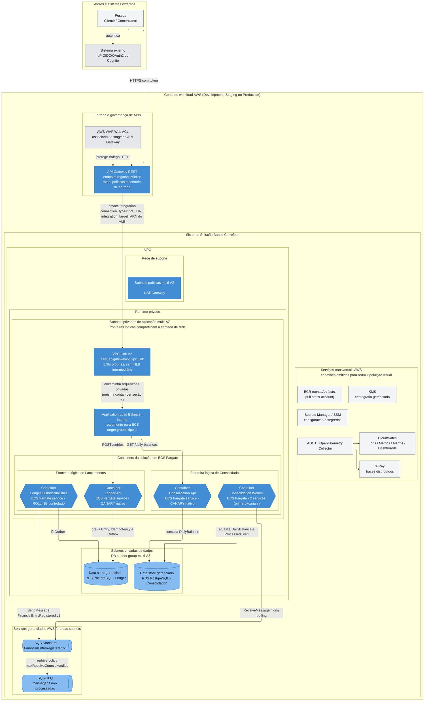
```mermaid
---
config:
  layout: elk
  flowchart:
    curve: linear
    nodeSpacing: 80
    rankSpacing: 110
---
flowchart TB
    subgraph external["Atores e sistemas externos"]
        direction LR
        client["Pessoa<br/>Cliente / Comerciante"]
        idp["Sistema externo<br/>IdP OIDC/OAuth2 ou Cognito"]
    end

    subgraph aws["Conta de workload AWS (Development, Staging ou Production)"]
        direction TB

        subgraph edge["Entrada e governança de APIs"]
            direction TB
            waf["AWS WAF Web ACL<br/>associado ao stage do API Gateway"]
            apiGateway["API Gateway REST<br/>endpoint regional público<br/>rotas, políticas e controle de entrada"]
        end

        subgraph solution["Sistema: Solução Banco Carrefour"]
            direction TB

            subgraph vpc["VPC"]
                direction LR

                subgraph leftNetworkColumn["Rede de suporte"]
                    direction TB
                    networkSpacer[" "]
                    publicSubnets["Subnets públicas multi-AZ<br/><br/>NAT Gateway"]
                end

                subgraph privateRuntimeColumn["Runtime privado"]
                    direction TB

                    subgraph appSubnets["Subnets privadas de aplicação multi-AZ<br/>fronteiras lógicas compartilham a camada de rede"]
                        direction TB

                        vpcLinkV2["VPC Link V2<br/>aws_apigatewayv2_vpc_link<br/>ENIs próprias, sem NLB intermediário"]
                        alb["Application Load Balancer interno<br/>roteamento para ECS<br/>target groups tipo ip"]

                        subgraph runtime["Containers da solução em ECS Fargate"]
                            direction LR

                            subgraph consolidationBoundary["Fronteira lógica de Consolidado"]
                                direction TB
                                consolidationApi@{ shape: hex, label: "Container<br/>Consolidation.Api<br/>ECS Fargate service - CANARY nativo" }
                                consolidationWorker@{ shape: hex, label: "Container<br/>Consolidation.Worker<br/>ECS Fargate - 2 services (primary+canary)" }
                            end

                            subgraph ledgerBoundary["Fronteira lógica de Lançamentos"]
                                direction TB
                                ledgerApi@{ shape: hex, label: "Container<br/>Ledger.Api<br/>ECS Fargate service - CANARY nativo" }
                                outboxPublisher@{ shape: hex, label: "Container<br/>Ledger.OutboxPublisher<br/>ECS Fargate service - ROLLING controlado" }
                            end
                        end
                    end

                    subgraph dataSubnets["Subnets privadas de dados<br/>DB subnet group multi-AZ"]
                        direction LR
                        consolidationRds[("Data store gerenciado<br/>RDS PostgreSQL - Consolidation")]
                        ledgerRds[("Data store gerenciado<br/>RDS PostgreSQL - Ledger")]
                    end
                end
            end

            subgraph messaging["Serviços gerenciados AWS fora das subnets"]
                direction TB
                sqs@{ shape: h-cyl, label: "SQS Standard<br/>FinancialEntryRegistered.v1" }
                dlq@{ shape: h-cyl, label: "SQS DLQ<br/>mensagens não processadas" }
            end

            subgraph crossCutting["Serviços transversais AWS<br/>conexões omitidas para reduzir poluição visual"]
                direction LR
                ecr["ECR (conta Artifacts,<br/>pull cross-account)"]
                secrets["Secrets Manager / SSM<br/>configuração e segredos"]
                kms["KMS<br/>criptografia gerenciada"]
                adot["ADOT / OpenTelemetry Collector"]
                cloudwatch["CloudWatch<br/>Logs / Metrics / Alarms / Dashboards"]
                xray["X-Ray<br/>traces distribuídos"]
            end
        end
    end

    client -.->|"autentica"| idp
    client -->|"HTTPS com token"| apiGateway
    waf -.->|"protege tráfego HTTP"| apiGateway

    apiGateway -->|"private integration<br/>connection_type=VPC_LINK<br/>integration_target=ARN do ALB"| vpcLinkV2
    vpcLinkV2 -->|"encaminha requisições privadas<br/>(mesma conta - ver seção 4)"| alb

    alb -->|"GET /daily-balances"| consolidationApi
    alb -->|"POST /entries"| ledgerApi

    consolidationApi -->|"consulta DailyBalance"| consolidationRds
    consolidationWorker -->|"atualiza DailyBalance e ProcessedEvent"| consolidationRds
    consolidationWorker -->|"ReceiveMessage / long polling"| sqs

    ledgerApi -->|"grava Entry, Idempotency e Outbox"| ledgerRds
    outboxPublisher -->|"lê Outbox"| ledgerRds
    outboxPublisher -->|"SendMessage FinancialEntryRegistered.v1"| sqs

    sqs -->|"redrive policy<br/>maxReceiveCount excedido"| dlq

    adot --> cloudwatch
    adot --> xray

    networkSpacer ~~~ publicSubnets
    leftNetworkColumn ~~~ privateRuntimeColumn

    style networkSpacer fill:transparent,stroke:transparent,color:transparent

    classDef personNode stroke:#6b7280,fill:#f3f4f6,color:#111827
    classDef externalNode stroke:#6b7280,fill:#e5e7eb,color:#111827
    classDef internalNode stroke:#1168bd,fill:#438dd5,color:#ffffff
    classDef containerNode stroke:#1168bd,fill:#438dd5,color:#ffffff
    classDef dataNode stroke:#1168bd,fill:#85bbf0,color:#111827
    classDef queueNode stroke:#1168bd,fill:#85bbf0,color:#111827
    classDef securityNode stroke:#6b7280,fill:#e5e7eb,color:#111827
    classDef transversalNode stroke:#6b7280,fill:#f3f4f6,color:#111827
    classDef boundaryNode stroke:#6b7280,fill:#ffffff,color:#111827

    class client personNode
    class idp externalNode
    class waf securityNode
    class apiGateway,vpcLinkV2,alb,publicSubnets internalNode
    class consolidationApi,consolidationWorker,ledgerApi,outboxPublisher containerNode
    class consolidationRds,ledgerRds dataNode
    class sqs,dlq queueNode
    class ecr,secrets,kms,adot,cloudwatch,xray transversalNode
```

Esta visão mostra a topologia C4 Container real da implantação AWS (idêntica em estrutura nos 3 ambientes de workload - as diferenças de dimensionamento e estratégia estão nas seções 6-8). O API Gateway REST atua como camada de entrada e governança de APIs. O acesso aos serviços privados ocorre por **VPC Link V2** (`aws_apigatewayv2_vpc_link`) **diretamente** para o Application Load Balancer interno - **sem NLB intermediário e sem VPC Link clássico (v1)**, conforme ADR-0008: a integração real usa `connection_type = "VPC_LINK"` com `connection_id` apontando para o VPC Link V2 e `integration_target` apontando diretamente para o ARN do ALB. Todos os quatro recursos dessa cadeia (REST API, VPC Link V2, ALB, VPC) pertencem à mesma conta de workload.

As fronteiras de Lançamentos e Consolidado são lógicas e compartilham subnets privadas de aplicação multi-AZ. A separação operacional ocorre por ECS services, target groups, security groups, IAM roles, persistências independentes e fila assíncrona.

SQS é um serviço gerenciado fora das subnets. A relação entre `Consolidation.Worker` e SQS representa leitura por `ReceiveMessage`/long polling. Falhas recorrentes são tratadas por visibility timeout, receive count, redrive policy e DLQ.

KMS, Secrets Manager/SSM, ECR (pull cross-account a partir da conta Artifacts), CloudWatch, X-Ray, ADOT e acesso via NAT Gateway são transversais e foram simplificados para preservar legibilidade.

A visualização não representa sizing exato, região, quantidade final de AZs, política final de subnets ou landing zone real - ver seções 6-8 para as diferenças reais por ambiente.

---

## 6. C4 Deployment: Development

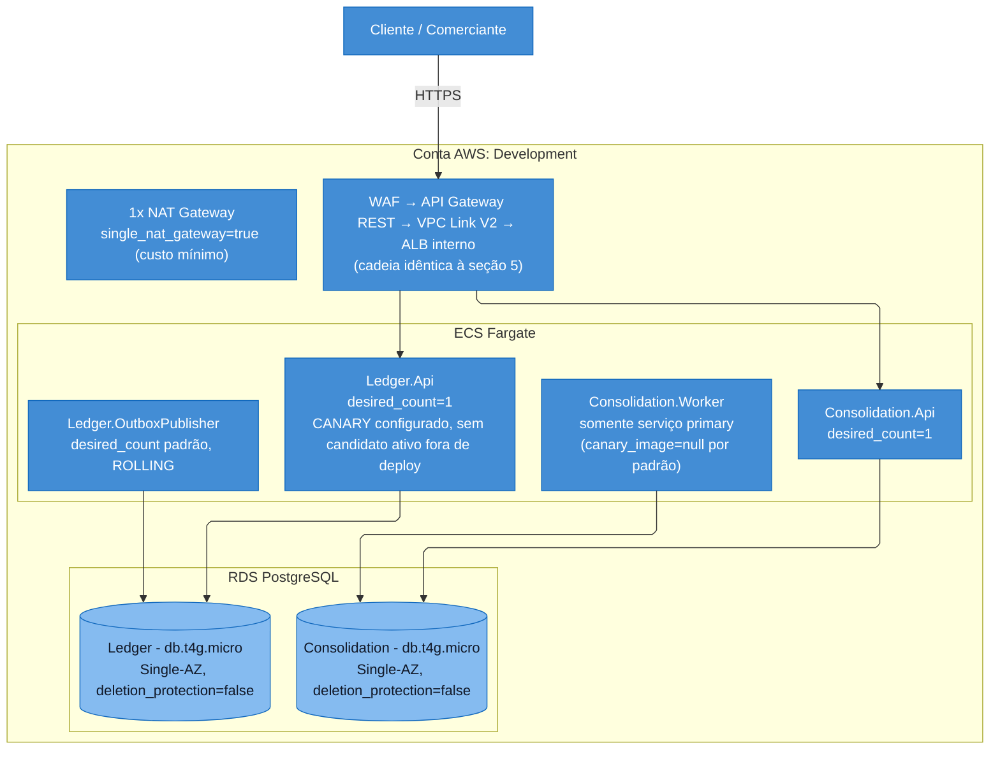
```mermaid
---
config:
  layout: elk
  flowchart:
    curve: linear
    nodeSpacing: 70
    rankSpacing: 90
---
flowchart TB
    client["Cliente / Comerciante"]

    subgraph devAccount["Conta AWS: Development"]
        direction TB
        edgeDev["WAF → API Gateway REST → VPC Link V2 → ALB interno<br/>(cadeia idêntica à seção 5)"]
        natDev["1x NAT Gateway<br/>single_nat_gateway=true (custo mínimo)"]

        subgraph ecsDev["ECS Fargate"]
            direction LR
            ledgerApiDev["Ledger.Api<br/>desired_count=1<br/>CANARY configurado, sem candidato ativo fora de deploy"]
            consolidationApiDev["Consolidation.Api<br/>desired_count=1"]
            workerDev["Consolidation.Worker<br/>somente serviço primary<br/>(canary_image=null por padrão)"]
            publisherDev["Ledger.OutboxPublisher<br/>desired_count padrão, ROLLING"]
        end

        subgraph rdsDev["RDS PostgreSQL"]
            direction LR
            ledgerRdsDev[("Ledger - db.t4g.micro<br/>Single-AZ, deletion_protection=false")]
            consolidationRdsDev[("Consolidation - db.t4g.micro<br/>Single-AZ, deletion_protection=false")]
        end
    end

    client -->|"HTTPS"| edgeDev
    edgeDev --> ledgerApiDev
    edgeDev --> consolidationApiDev
    ledgerApiDev --> ledgerRdsDev
    publisherDev --> ledgerRdsDev
    consolidationApiDev --> consolidationRdsDev
    workerDev --> consolidationRdsDev

    classDef node stroke:#1168bd,fill:#438dd5,color:#ffffff
    classDef dataNode stroke:#1168bd,fill:#85bbf0,color:#111827
    class edgeDev,natDev,ledgerApiDev,consolidationApiDev,workerDev,publisherDev node
    class ledgerRdsDev,consolidationRdsDev dataNode
```

Development é o alvo do deploy automático (`deploy-development.yml`, sem aprovação humana) disparado após `publish-images.yml` publicar com sucesso. Dimensionamento mínimo (`terraform.tfvars.example`): `desired_count=1` para APIs/Worker, RDS `db.t4g.micro` Single-AZ sem proteção contra exclusão, 1 NAT Gateway compartilhado - indisponibilidade de egress é aceitável neste ambiente.

---

## 7. C4 Deployment: Staging

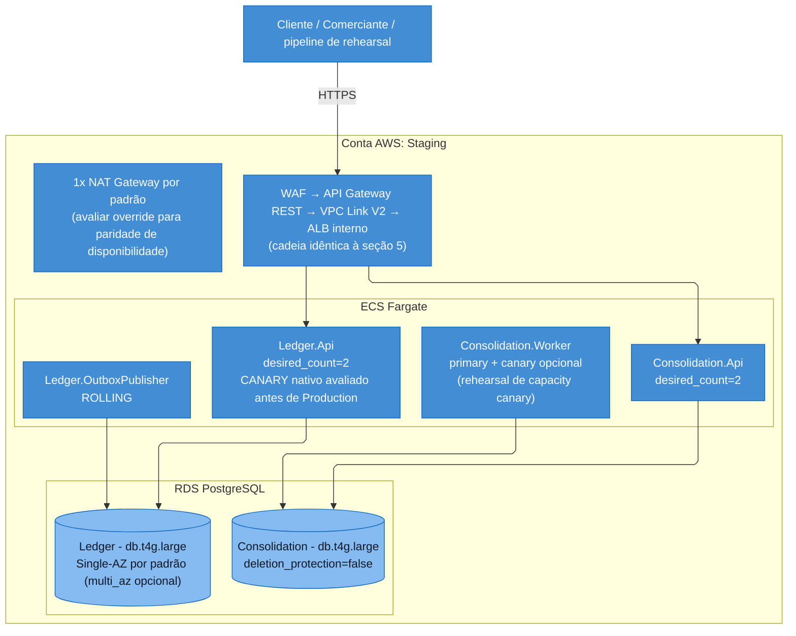
```mermaid
---
config:
  layout: elk
  flowchart:
    curve: linear
    nodeSpacing: 70
    rankSpacing: 90
---
flowchart TB
    client["Cliente / Comerciante / pipeline de rehearsal"]

    subgraph stagingAccount["Conta AWS: Staging"]
        direction TB
        edgeStaging["WAF → API Gateway REST → VPC Link V2 → ALB interno<br/>(cadeia idêntica à seção 5)"]
        natStaging["1x NAT Gateway por padrão<br/>(avaliar override para paridade de disponibilidade)"]

        subgraph ecsStaging["ECS Fargate"]
            direction LR
            ledgerApiStaging["Ledger.Api<br/>desired_count=2<br/>CANARY nativo avaliado antes de Production"]
            consolidationApiStaging["Consolidation.Api<br/>desired_count=2"]
            workerStaging["Consolidation.Worker<br/>primary + canary opcional<br/>(rehearsal de capacity canary)"]
            publisherStaging["Ledger.OutboxPublisher<br/>ROLLING"]
        end

        subgraph rdsStaging["RDS PostgreSQL"]
            direction LR
            ledgerRdsStaging[("Ledger - db.t4g.large<br/>Single-AZ por padrão (multi_az opcional)")]
            consolidationRdsStaging[("Consolidation - db.t4g.large<br/>deletion_protection=false")]
        end
    end

    client -->|"HTTPS"| edgeStaging
    edgeStaging --> ledgerApiStaging
    edgeStaging --> consolidationApiStaging
    ledgerApiStaging --> ledgerRdsStaging
    publisherStaging --> ledgerRdsStaging
    consolidationApiStaging --> consolidationRdsStaging
    workerStaging --> consolidationRdsStaging

    classDef node stroke:#1168bd,fill:#438dd5,color:#ffffff
    classDef dataNode stroke:#1168bd,fill:#85bbf0,color:#111827
    class edgeStaging,natStaging,ledgerApiStaging,consolidationApiStaging,workerStaging,publisherStaging node
    class ledgerRdsStaging,consolidationRdsStaging dataNode
```

Staging é o alvo de `promote-staging.yml` (manual, informando o `run-id` do deploy bem-sucedido em Development - nunca reconstrói). Dimensionamento intermediário: `desired_count=2`, RDS `db.t4g.large`. `rds_multi_az` é opcional (default `false` por custo) - recomenda-se `true` em pelo menos uma rodada de rehearsal de rollback antes de uma promoção real a Production, exatamente para validar a mesma topologia de disponibilidade.

---

## 8. C4 Deployment: Production

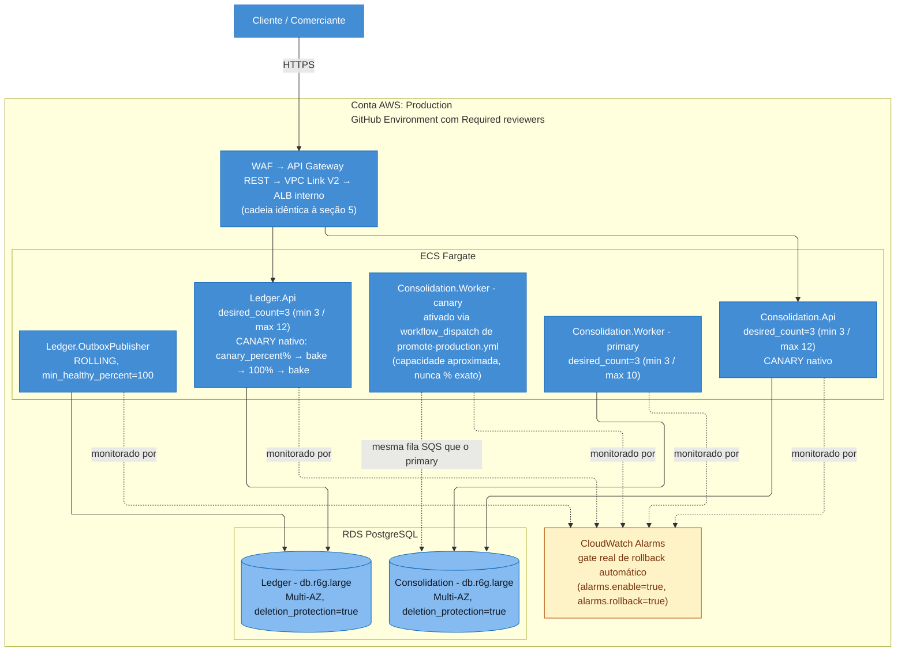
```mermaid
---
config:
  layout: elk
  flowchart:
    curve: linear
    nodeSpacing: 70
    rankSpacing: 90
---
flowchart TB
    client["Cliente / Comerciante"]

    subgraph prodAccount["Conta AWS: Production<br/>GitHub Environment com Required reviewers"]
        direction TB
        edgeProd["WAF → API Gateway REST → VPC Link V2 → ALB interno<br/>(cadeia idêntica à seção 5)"]

        subgraph ecsProd["ECS Fargate"]
            direction LR
            ledgerApiProd["Ledger.Api<br/>desired_count=3 (min 3 / max 12)<br/>CANARY nativo: canary_percent% → bake → 100% → bake"]
            consolidationApiProd["Consolidation.Api<br/>desired_count=3 (min 3 / max 12)<br/>CANARY nativo"]
            workerPrimaryProd["Consolidation.Worker - primary<br/>desired_count=3 (min 3 / max 10)"]
            workerCanaryProd["Consolidation.Worker - canary<br/>ativado via workflow_dispatch de promote-production.yml<br/>(capacidade aproximada, nunca % exato)"]
            publisherProd["Ledger.OutboxPublisher<br/>ROLLING, min_healthy_percent=100"]
        end

        subgraph rdsProd["RDS PostgreSQL"]
            direction LR
            ledgerRdsProd[("Ledger - db.r6g.large<br/>Multi-AZ, deletion_protection=true")]
            consolidationRdsProd[("Consolidation - db.r6g.large<br/>Multi-AZ, deletion_protection=true")]
        end

        alarmsProd["CloudWatch Alarms<br/>gate real de rollback automático<br/>(alarms.enable=true, alarms.rollback=true)"]
    end

    client -->|"HTTPS"| edgeProd
    edgeProd --> ledgerApiProd
    edgeProd --> consolidationApiProd
    ledgerApiProd --> ledgerRdsProd
    publisherProd --> ledgerRdsProd
    consolidationApiProd --> consolidationRdsProd
    workerPrimaryProd --> consolidationRdsProd
    workerCanaryProd -.->|"mesma fila SQS que o primary"| consolidationRdsProd

    ledgerApiProd -.->|"monitorado por"| alarmsProd
    consolidationApiProd -.->|"monitorado por"| alarmsProd
    workerPrimaryProd -.->|"monitorado por"| alarmsProd
    workerCanaryProd -.->|"monitorado por"| alarmsProd
    publisherProd -.->|"monitorado por"| alarmsProd

    classDef node stroke:#1168bd,fill:#438dd5,color:#ffffff
    classDef dataNode stroke:#1168bd,fill:#85bbf0,color:#111827
    classDef alarmNode stroke:#b45309,fill:#fef3c7,color:#78350f
    class edgeProd,ledgerApiProd,consolidationApiProd,workerPrimaryProd,workerCanaryProd,publisherProd node
    class ledgerRdsProd,consolidationRdsProd dataNode
    class alarmsProd alarmNode
```

Production é o alvo de `promote-production.yml`, protegido pelo GitHub Environment `production` (Required reviewers configurado externamente - o workflow nunca impõe essa aprovação sozinho). Dimensionamento máximo (`desired_count=3`, `min=3`/`max=12` para as APIs, RDS `db.r6g.large` Multi-AZ com `deletion_protection=true`). O serviço `consolidation-worker-canary` só existe quando `consolidation_worker_canary_image` é informado no `workflow_dispatch` (seção 15) - sua ausência é o estado normal fora de uma avaliação de candidato.

---

## 9. Fluxo — Registro de lançamento

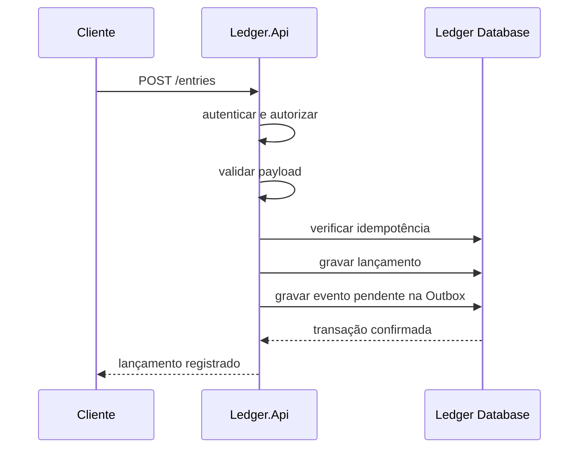
```mermaid
sequenceDiagram
    participant C as Cliente
    participant API as Ledger.Api
    participant DB as Ledger Database

    C->>API: POST /entries
    API->>API: autenticar e autorizar
    API->>API: validar payload
    API->>DB: verificar idempotência
    API->>DB: gravar lançamento
    API->>DB: gravar evento pendente na Outbox
    DB-->>API: transação confirmada
    API-->>C: lançamento registrado
```

Esse fluxo mantém o registro financeiro dentro da fronteira de Lançamentos e não depende do Consolidado.

---

## 10. Fluxo — Publicação via Outbox

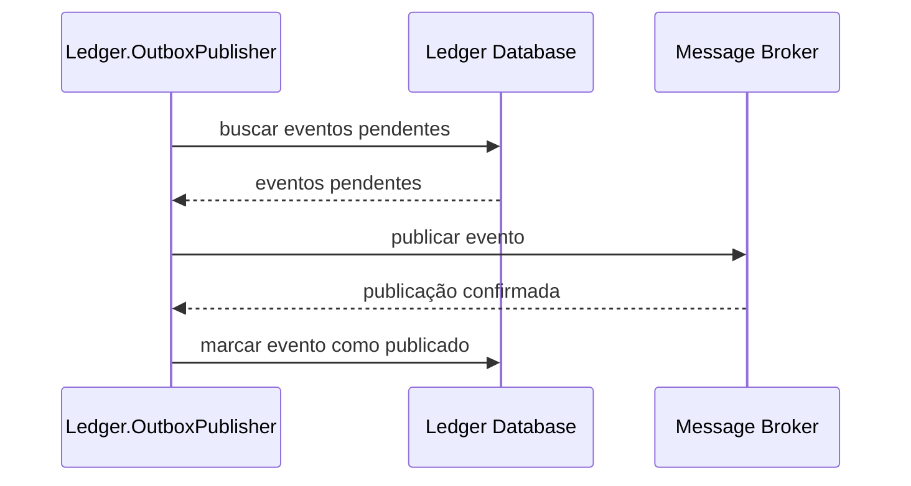
```mermaid
sequenceDiagram
    participant P as Ledger.OutboxPublisher
    participant DB as Ledger Database
    participant B as Message Broker

    P->>DB: buscar eventos pendentes
    DB-->>P: eventos pendentes
    P->>B: publicar evento
    B-->>P: publicação confirmada
    P->>DB: marcar evento como publicado
```

Esse fluxo torna a publicação recuperável e evita perda silenciosa entre persistência e envio ao broker.

---

## 11. Fluxo — Consolidação

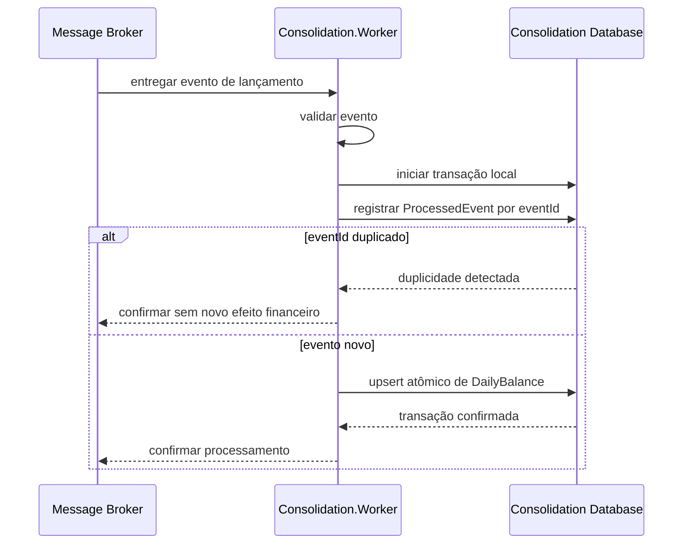
```mermaid
sequenceDiagram
    participant B as Message Broker
    participant W as Consolidation.Worker
    participant DB as Consolidation Database

    B->>W: entregar evento de lançamento
    W->>W: validar evento
    W->>DB: iniciar transação local
    W->>DB: registrar ProcessedEvent por eventId
    alt eventId duplicado
        DB-->>W: duplicidade detectada
        W-->>B: confirmar sem novo efeito financeiro
    else evento novo
        W->>DB: upsert atômico de DailyBalance
        DB-->>W: transação confirmada
        W-->>B: confirmar processamento
    end
```

Esse fluxo materializa consumo at-least-once com processamento idempotente. `ProcessedEvent` e `DailyBalance` são tratados na mesma transação local; duplicidade concorrente de `eventId` não reaplica saldo.

---

## 12. Fluxo — Consulta do consolidado

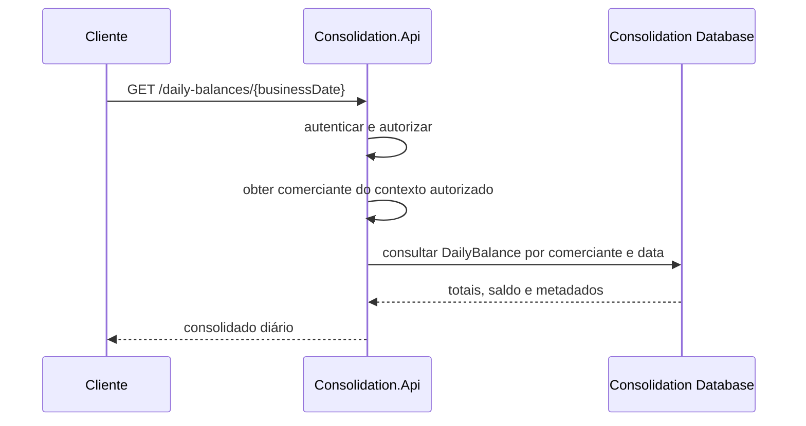
```mermaid
sequenceDiagram
    participant C as Cliente
    participant API as Consolidation.Api
    participant DB as Consolidation Database

    C->>API: GET /daily-balances/{businessDate}
    API->>API: autenticar e autorizar
    API->>API: obter comerciante do contexto autorizado
    API->>DB: consultar DailyBalance por comerciante e data
    DB-->>API: totais, saldo e metadados
    API-->>C: consolidado diário
```

Esse fluxo atende a consulta do relatório diário sem recalcular o saldo a partir de todos os lançamentos em cada requisição.

---

## 13. Fluxo — Release qualification

Referência: `.github/workflows/release-qualification.yml` (dry-run manual, `workflow_dispatch`).

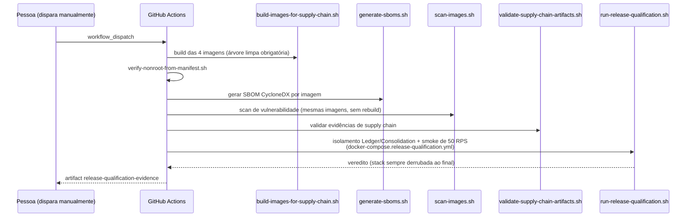
```mermaid
sequenceDiagram
    participant Dev as Pessoa (dispara manualmente)
    participant GH as GitHub Actions
    participant Build as build-images-for-supply-chain.sh
    participant SBOM as generate-sboms.sh
    participant Scan as scan-images.sh
    participant Val as validate-supply-chain-artifacts.sh
    participant RQ as run-release-qualification.sh

    Dev->>GH: workflow_dispatch
    GH->>Build: build das 4 imagens (árvore limpa obrigatória)
    GH->>GH: verify-nonroot-from-manifest.sh
    GH->>SBOM: gerar SBOM CycloneDX por imagem
    GH->>Scan: scan de vulnerabilidade (mesmas imagens, sem rebuild)
    GH->>Val: validar evidências de supply chain
    GH->>RQ: isolamento Ledger/Consolidation + smoke de 50 RPS<br/>(docker-compose.release-qualification.yml)
    RQ-->>GH: veredito (stack sempre derrubada ao final)
    GH-->>Dev: artifact release-qualification-evidence
```

Execução isolada de dry-run - não publica no ECR nem gera manifesto de release. Usado para validar a suíte de qualificação sem afetar a cadeia real de publicação.

---

## 14. Fluxo — Build-once e publicação no Amazon ECR

Referência: `.github/workflows/publish-images.yml`, job único `build-scan-publish` (build-once real: as mesmas 4 imagens em memória/disco do runner atravessam build, SBOM, scan, release-qualification e publicação, sem rebuild e sem transferência entre jobs).

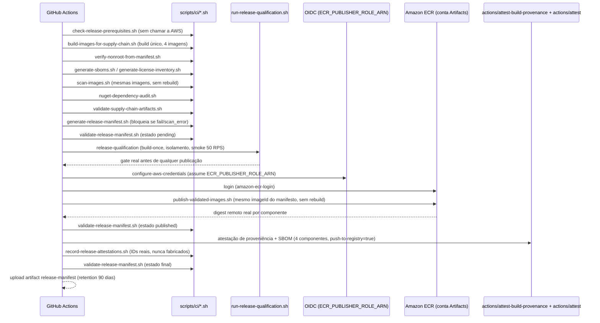
```mermaid
sequenceDiagram
    participant GH as GitHub Actions
    participant Scripts as scripts/ci/*.sh
    participant RQ as run-release-qualification.sh
    participant OIDC as OIDC (ECR_PUBLISHER_ROLE_ARN)
    participant ECR as Amazon ECR (conta Artifacts)
    participant Attest as actions/attest-build-provenance + actions/attest

    GH->>Scripts: check-release-prerequisites.sh (sem chamar a AWS)
    GH->>Scripts: build-images-for-supply-chain.sh (build único, 4 imagens)
    GH->>Scripts: verify-nonroot-from-manifest.sh
    GH->>Scripts: generate-sboms.sh / generate-license-inventory.sh
    GH->>Scripts: scan-images.sh (mesmas imagens, sem rebuild)
    GH->>Scripts: nuget-dependency-audit.sh
    GH->>Scripts: validate-supply-chain-artifacts.sh
    GH->>Scripts: generate-release-manifest.sh (bloqueia se fail/scan_error)
    GH->>Scripts: validate-release-manifest.sh (estado pending)
    GH->>RQ: release-qualification (build-once, isolamento, smoke 50 RPS)
    RQ-->>GH: gate real antes de qualquer publicação
    GH->>OIDC: configure-aws-credentials (assume ECR_PUBLISHER_ROLE_ARN)
    GH->>ECR: login (amazon-ecr-login)
    GH->>ECR: publish-validated-images.sh (mesmo imageId do manifesto, sem rebuild)
    ECR-->>GH: digest remoto real por componente
    GH->>Scripts: validate-release-manifest.sh (estado published)
    GH->>Attest: atestação de proveniência + SBOM (4 componentes, push-to-registry=true)
    GH->>Scripts: record-release-attestations.sh (IDs reais, nunca fabricados)
    GH->>Scripts: validate-release-manifest.sh (estado final)
    GH-->>GH: upload artifact release-manifest (retention 90 dias)
```

O manifesto de release publicado como artifact (`release-manifest`) é o único insumo consumido pelos workflows de deploy/promoção (seções 15-17) - nenhum deles reconsulta o ECR ou reconstrói imagem.

---

## 15. Fluxo — Deploy em Development

Referência: `.github/workflows/deploy-development.yml` (automático, `workflow_run` após `Publish Images` concluir com sucesso - sem aprovação humana).

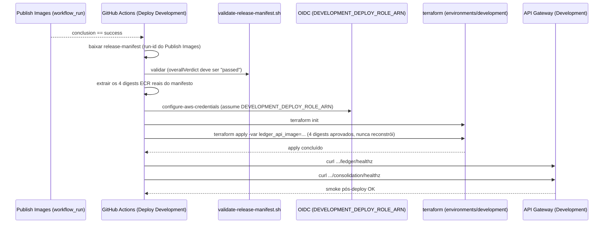
```mermaid
sequenceDiagram
    participant Publish as Publish Images (workflow_run)
    participant GH as GitHub Actions (Deploy Development)
    participant Manifest as validate-release-manifest.sh
    participant OIDC as OIDC (DEVELOPMENT_DEPLOY_ROLE_ARN)
    participant TF as terraform (environments/development)
    participant APIGW as API Gateway (Development)

    Publish-->>GH: conclusion == success
    GH->>GH: baixar release-manifest (run-id do Publish Images)
    GH->>Manifest: validar (overallVerdict deve ser "passed")
    GH->>GH: extrair os 4 digests ECR reais do manifesto
    GH->>OIDC: configure-aws-credentials (assume DEVELOPMENT_DEPLOY_ROLE_ARN)
    GH->>TF: terraform init
    GH->>TF: terraform apply -var ledger_api_image=... (4 digests aprovados, nunca reconstrói)
    TF-->>GH: apply concluído
    GH->>APIGW: curl .../ledger/healthz
    GH->>APIGW: curl .../consolidation/healthz
    APIGW-->>GH: smoke pós-deploy OK
```

`overallVerdict != "passed"` bloqueia o deploy antes de qualquer `terraform apply` (`exit 1` explícito). O smoke é um health-check via API Gateway, não uma suíte completa.

---

## 16. Fluxo — Promoção para Staging

Referência: `.github/workflows/promote-staging.yml` (manual, `workflow_dispatch` com `development_deploy_run_id`).

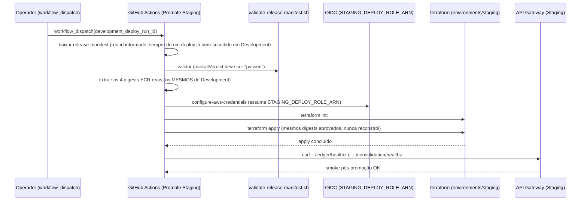
```mermaid
sequenceDiagram
    participant Op as Operador (workflow_dispatch)
    participant GH as GitHub Actions (Promote Staging)
    participant Manifest as validate-release-manifest.sh
    participant OIDC as OIDC (STAGING_DEPLOY_ROLE_ARN)
    participant TF as terraform (environments/staging)
    participant APIGW as API Gateway (Staging)

    Op->>GH: workflow_dispatch(development_deploy_run_id)
    GH->>GH: baixar release-manifest (run-id informado, sempre de um deploy já bem-sucedido em Development)
    GH->>Manifest: validar (overallVerdict deve ser "passed")
    GH->>GH: extrair os 4 digests ECR reais (os MESMOS de Development)
    GH->>OIDC: configure-aws-credentials (assume STAGING_DEPLOY_ROLE_ARN)
    GH->>TF: terraform init
    GH->>TF: terraform apply (mesmos digests aprovados, nunca reconstrói)
    TF-->>GH: apply concluído
    GH->>APIGW: curl .../ledger/healthz e .../consolidation/healthz
    APIGW-->>GH: smoke pós-promoção OK
```

A promoção nunca reconsulta o manifesto de publicação diretamente - o input explícito é o `run-id` de um `deploy-development.yml` já bem-sucedido, garantindo que só uma release já implantada com sucesso em Development seja promovida.

---

## 17. Fluxo — Promoção para Production (CANARY nativo do ECS)

Referência: `.github/workflows/promote-production.yml` (manual, `workflow_dispatch` com `staging_promote_run_id`; ambiente `production` protegido por Required reviewers externo).

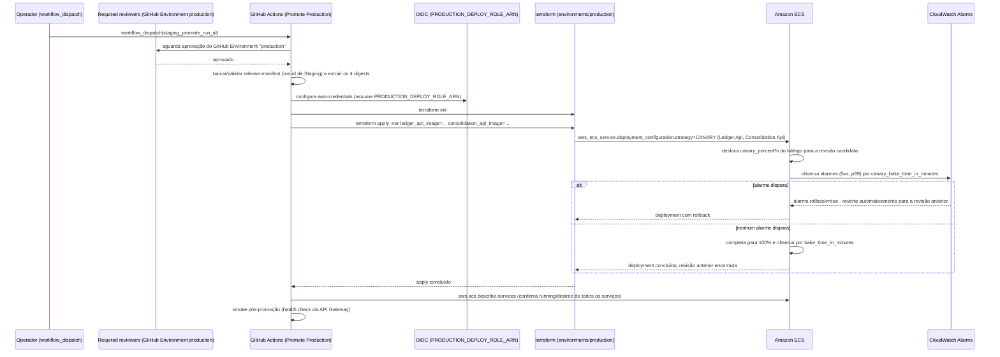
```mermaid
sequenceDiagram
    participant Op as Operador (workflow_dispatch)
    participant Reviewer as Required reviewers (GitHub Environment production)
    participant GH as GitHub Actions (Promote Production)
    participant OIDC as OIDC (PRODUCTION_DEPLOY_ROLE_ARN)
    participant TF as terraform (environments/production)
    participant ECS as Amazon ECS
    participant CW as CloudWatch Alarms

    Op->>GH: workflow_dispatch(staging_promote_run_id)
    GH->>Reviewer: aguarda aprovação do GitHub Environment "production"
    Reviewer-->>GH: aprovado
    GH->>GH: baixar/validar release-manifest (run-id de Staging) e extrair os 4 digests
    GH->>OIDC: configure-aws-credentials (assume PRODUCTION_DEPLOY_ROLE_ARN)
    GH->>TF: terraform init
    GH->>TF: terraform apply -var ledger_api_image=... consolidation_api_image=...
    TF->>ECS: aws_ecs_service.deployment_configuration.strategy=CANARY (Ledger.Api, Consolidation.Api)
    ECS->>ECS: desloca canary_percent% do tráfego para a revisão candidata
    ECS->>CW: observa alarmes (5xx, p99) por canary_bake_time_in_minutes
    alt alarme dispara
        CW-->>ECS: alarms.rollback=true - reverte automaticamente para a revisão anterior
        ECS-->>TF: deployment com rollback
    else nenhum alarme dispara
        ECS->>ECS: completa para 100% e observa por bake_time_in_minutes
        ECS-->>TF: deployment concluído, revisão anterior encerrada
    end
    TF-->>GH: apply concluído
    GH->>ECS: aws ecs describe-services (confirma running/desired de todos os serviços)
    GH->>GH: smoke pós-promoção (health check via API Gateway)
```

O gate real de rollback automático acontece **dentro do próprio ECS/CloudWatch** durante o `terraform apply` (`alarms{enable=true, rollback=true}`) - o passo de `describe-services` apenas confirma o estado final, nunca substitui esse gate.

---

## 18. Fluxo — Capacity canary do Consolidation.Worker

Sem ALB (sem endpoint HTTP), nenhuma estratégia nativa de traffic-shift do ECS se aplica - o padrão é dois `aws_ecs_service` independentes (`primary`+`canary`) consumindo a mesma fila SQS. Ativado via os inputs `consolidation_worker_canary_image`/`consolidation_worker_canary_desired_count` de `promote-production.yml` (corrigido nesta rodada de fechamento - o workflow antes não expunha esses inputs).

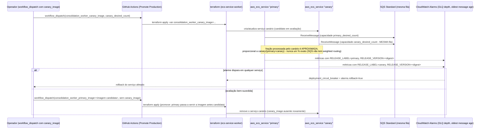
```mermaid
sequenceDiagram
    participant Op as Operador (workflow_dispatch com canary_image)
    participant GH as GitHub Actions (Promote Production)
    participant TF as terraform (ecs-service-worker)
    participant Primary as aws_ecs_service "primary"
    participant Canary as aws_ecs_service "canary"
    participant SQS as SQS Standard (mesma fila)
    participant CW as CloudWatch Alarms (DLQ depth, oldest message age)

    Op->>GH: workflow_dispatch(consolidation_worker_canary_image, canary_desired_count)
    GH->>TF: terraform apply -var consolidation_worker_canary_image=...
    TF->>Canary: cria/atualiza serviço canário (candidato em avaliação)
    Primary->>SQS: ReceiveMessage (capacidade primary_desired_count)
    Canary->>SQS: ReceiveMessage (capacidade canary_desired_count - MESMA fila)
    Note over Primary,Canary: fração processada pelo canário é APROXIMADA,<br/>proporcional a canary/(primary+canary) - nunca um % exato (SQS não tem weighted routing)
    Primary-->>CW: métricas com RELEASE_LABEL=primary, RELEASE_VERSION=<digest>
    Canary-->>CW: métricas com RELEASE_LABEL=canary, RELEASE_VERSION=<digest>
    alt alarme dispara em qualquer serviço
        CW-->>TF: deployment_circuit_breaker + alarms.rollback=true
        TF-->>Op: rollback do serviço afetado
    else avaliação bem-sucedida
        Op->>GH: workflow_dispatch(consolidation_worker_primary_image=<imagem candidata>, sem canary_image)
        GH->>TF: terraform apply (promove: primary passa a servir a imagem antes candidata)
        TF->>Canary: remove o serviço canário (canary_image ausente novamente)
    end
```

Promoção e remoção do canário são sempre mudanças de variáveis conduzidas pelo Terraform via este workflow - nunca uma chamada AWS ad-hoc fora do state.

---

## 19. Fluxo — Rolling deployment do Ledger.OutboxPublisher

Sem ALB, sem canary artificial de HTTP. `deployment_configuration.strategy="ROLLING"` com `deployment_minimum_healthy_percent=100` (nunca reduz capacidade durante o rollout).

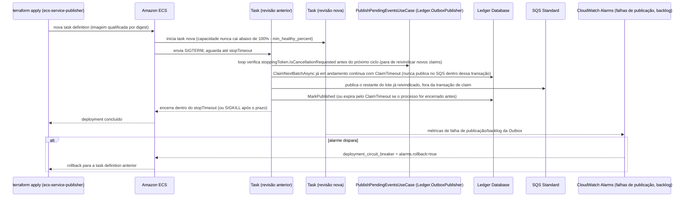
```mermaid
sequenceDiagram
    participant TF as terraform apply (ecs-service-publisher)
    participant ECS as Amazon ECS
    participant OldTask as Task (revisão anterior)
    participant NewTask as Task (revisão nova)
    participant Outbox as PublishPendingEventsUseCase (Ledger.OutboxPublisher)
    participant DB as Ledger Database
    participant SQS as SQS Standard
    participant CW as CloudWatch Alarms (falhas de publicação, backlog)

    TF->>ECS: nova task definition (imagem qualificada por digest)
    ECS->>NewTask: inicia task nova (capacidade nunca cai abaixo de 100% - min_healthy_percent)
    ECS->>OldTask: envia SIGTERM, aguarda até stopTimeout
    OldTask->>Outbox: loop verifica stoppingToken.IsCancellationRequested antes do próximo ciclo (para de reivindicar novos claims)
    OldTask->>DB: ClaimNextBatchAsync já em andamento continua com ClaimTimeout (nunca publica no SQS dentro dessa transação)
    OldTask->>SQS: publica o restante do lote já reivindicado, fora da transação de claim
    OldTask->>DB: MarkPublished (ou expira pelo ClaimTimeout se o processo for encerrado antes)
    OldTask-->>ECS: encerra dentro do stopTimeout (ou SIGKILL após o prazo)
    ECS-->>TF: deployment concluído
    NewTask-->>CW: métricas de falha de publicação/backlog da Outbox
    alt alarme dispara
        CW-->>ECS: deployment_circuit_breaker + alarms.rollback=true
        ECS-->>TF: rollback para a task definition anterior
    end
```

O mecanismo real de "parar de aceitar novos claims" é a checagem de `stoppingToken` no `BackgroundService.ExecuteAsync` (`Worker.cs`), e a segurança contra perda de claim é o `ClaimTimeout` recuperável (ADR-0004) - não um handler explícito de SIGTERM na aplicação. `stopTimeout` (IaC) e esse comportamento de aplicação são mecanismos distintos que se complementam: o primeiro dá tempo, o segundo garante que nenhum item fique preso indefinidamente se esse tempo não for suficiente.

---

## 20. Fluxo — Rollback de Production

Referência: `.github/workflows/rollback-production.yml` (manual, exige `previous_promote_run_id` e `current_failed_run_id` distintos).

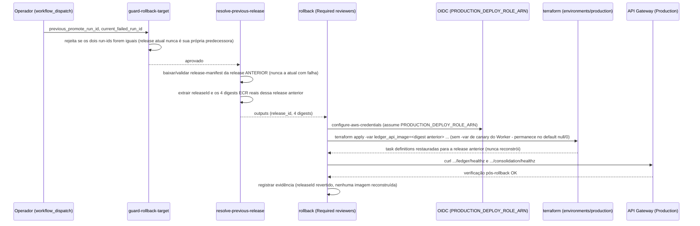
```mermaid
sequenceDiagram
    participant Op as Operador (workflow_dispatch)
    participant Guard as guard-rollback-target
    participant Resolve as resolve-previous-release
    participant GH as rollback (Required reviewers)
    participant OIDC as OIDC (PRODUCTION_DEPLOY_ROLE_ARN)
    participant TF as terraform (environments/production)
    participant APIGW as API Gateway (Production)

    Op->>Guard: previous_promote_run_id, current_failed_run_id
    Guard->>Guard: rejeita se os dois run-ids forem iguais (release atual nunca é sua própria predecessora)
    Guard-->>Resolve: aprovado
    Resolve->>Resolve: baixar/validar release-manifest da release ANTERIOR (nunca a atual com falha)
    Resolve->>Resolve: extrair releaseId e os 4 digests ECR reais dessa release anterior
    Resolve-->>GH: outputs (release_id, 4 digests)
    GH->>OIDC: configure-aws-credentials (assume PRODUCTION_DEPLOY_ROLE_ARN)
    GH->>TF: terraform apply -var ledger_api_image=<digest anterior> ... (sem -var de canary do Worker - permanece no default null/0)
    TF-->>GH: task definitions restauradas para a release anterior (nunca reconstrói)
    GH->>APIGW: curl .../ledger/healthz e .../consolidation/healthz
    APIGW-->>GH: verificação pós-rollback OK
    GH->>GH: registrar evidência (releaseId revertido, nenhuma imagem reconstruída)
```

Bootstrap: a primeira release promovida a Production não tem uma release anterior - o `download-artifact` do job `resolve-previous-release` falha de forma clara se o `run-id` informado não existir, nunca inventa uma release anterior fabricada.

---

## 21. Fluxo — Expand-and-contract (migração de schema compatível)

Mecanismo real, implementado e testado (ADR-0015) - nenhuma migração foi executada contra um RDS AWS real, mas o `MigrationRunner`, o advisory lock e a task ECS one-off são código/IaC reais, não apenas descritos. O diagrama abaixo substitui a versão anterior (conceitual/genérica) por esta, refletindo os participantes e a ordem reais.

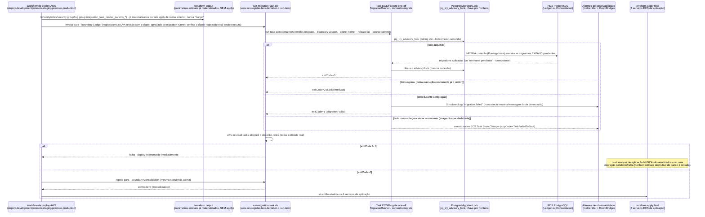
```mermaid
sequenceDiagram
    participant Workflow as Workflow de deploy AWS<br/>(deploy-development/promote-staging/promote-production)
    participant TF as terraform output<br/>(parâmetros estáveis já materializados, SEM apply)
    participant ECS as run-migration-task.sh<br/>(aws ecs register-task-definition + run-task)
    participant Task as Task ECS/Fargate one-off<br/>MigrationRunner - comando migrate
    participant Lock as PostgresMigrationLock<br/>(pg_try_advisory_lock, chave por fronteira)
    participant DB as RDS PostgreSQL<br/>(Ledger ou Consolidation)
    participant Alarm as Alarmes de observabilidade<br/>(metric filter + EventBridge)
    participant Apps as terraform apply final<br/>(4 serviços ECS de aplicação)

    Workflow->>TF: lê family/roles/security group/log group (migration_task_render_params_*) - já materializados por um apply de rotina anterior, nunca "-target"
    Workflow->>ECS: invoca para --boundary Ledger (registra uma NOVA revisão com o digest aprovado do migration-runner, verifica o digest registrado e só então executa)
    ECS->>Task: run-task com containerOverrides (migrate, --boundary Ledger, --secret-name, --release-id, --source-commit)
    Task->>Lock: pg_try_advisory_lock (polling até --lock-timeout-seconds)
    alt lock adquirido
        Lock->>DB: MESMA conexão (Pooling=false) executa as migrations EXPAND pendentes
        DB-->>Task: migrations aplicadas (ou "nenhuma pendente" - idempotente)
        Task->>Lock: libera o advisory lock (mesma conexão)
        Task-->>ECS: exitCode=0
    else lock expirou (outra execução concorrente já o detém)
        Task-->>ECS: exitCode=2 (LockTimedOut)
    else erro durante a migração
        Task->>Alarm: StructuredLog "migration.failed" (nunca inclui secrets/mensagem bruta de exceção)
        Task-->>ECS: exitCode=1 (MigrationFailed)
    else task nunca chega a iniciar o container (imagem/capacidade/rede)
        Task-->>Alarm: evento nativo ECS Task State Change (stopCode=TaskFailedToStart)
    end
    ECS->>ECS: aws ecs wait tasks-stopped + describe-tasks (extrai exitCode real)
    alt exitCode != 0
        ECS-->>Workflow: falha - deploy interrompido imediatamente
        Note over Apps: os 4 serviços de aplicação NUNCA são atualizados com uma<br/>migração pendente/falha (nenhum rollback destrutivo de banco é tentado)
    else exitCode=0
        Workflow->>ECS: repete para --boundary Consolidation (mesma sequência acima)
        ECS-->>Workflow: exitCode=0 (Consolidation)
        Workflow->>Apps: só então atualiza os 4 serviços de aplicação
    end
```

Fases (EXPAND/BACKFILL/CONTRACT), classificação machine-checkable via `[MigrationPhase(...)]`, e os 3 cenários de rollback (app-only pós-EXPAND; falha antes do deploy de app; falha de CONTRACT) estão detalhados em ADR-0015 e `docs/operations/runbook-implantacao-aws.md` (seções 5, 5.1, 7.1) - nunca duplicados aqui. `contract` (procedimento manual, protegido, exige `--approved-by`/`--compatibility-window-closed`) nunca aparece neste fluxo automatizado.

Regras rejeitadas por esta sequência (materializadas como testes de governança reais, ver `scripts/ci/validate-migration-governance.sh` e `Architecture.Tests`): migration destrutiva declarada `MigrationPhase.Expand`; qualquer workflow automatizado invocando `contract`; atualização dos 4 serviços de aplicação antes de ambas as migrações confirmarem `exitCode=0`; plano de rollback que exija rollback destrutivo de banco; mudança de contrato de evento incompatível com consumidores antigos (ADR-0013/0017, idempotência ADR-0003).

---

## 22. Visão operacional local

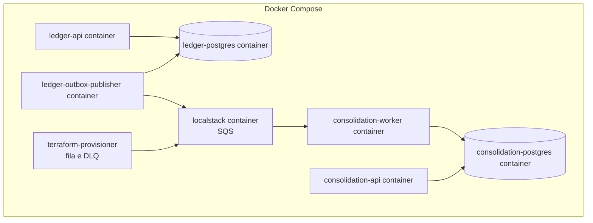
```mermaid
flowchart TB
    subgraph docker["Docker Compose"]
        ledgerApi["ledger-api container"]
        outboxPublisher["ledger-outbox-publisher container"]
        consolidationWorker["consolidation-worker container"]
        consolidationApi["consolidation-api container"]
        ledgerDb[("ledger-postgres container")]
        consolidationDb[("consolidation-postgres container")]
        localstack["localstack container<br/>SQS"]
        terraform["terraform-provisioner<br/>fila e DLQ"]
    end

    ledgerApi --> ledgerDb
    outboxPublisher --> ledgerDb
    terraform --> localstack
    outboxPublisher --> localstack
    localstack --> consolidationWorker
    consolidationWorker --> consolidationDb
    consolidationApi --> consolidationDb
```

Esta visão representa a execução local do desafio.

Docker Compose não representa a topologia definitiva de produção. Ele materializa uma forma reproduzível para avaliação, testes e validação dos fluxos principais.

---

## 23. C4 Component: Ledger.Api

```mermaid
---
config:
  layout: elk
  flowchart:
    curve: linear
    nodeSpacing: 70
    rankSpacing: 90
---
flowchart TB
    client["Pessoa<br/>Comerciante"]
    edge["Container externo<br/>edge-proxy (HTTPS/WAF)"]

    subgraph ledgerApi["Container: Ledger.Api"]
        direction TB
        endpoints["Componente<br/>Minimal API Endpoints<br/>EntryEndpoints.MapEntryEndpoints - POST /entries, /health/live, /health/ready"]
        authn["Componente<br/>Authentication/Authorization<br/>LedgerAuthentication - JwtBearer, MerchantPolicy, LedgerWriteScopePolicy"]
        rateLimit["Componente<br/>Rate Limiting<br/>BusinessRateLimiting"]
        useCase["Componente<br/>Register Financial Entry Use Case<br/>RegisterFinancialEntryUseCase (Ledger.Application)"]
        domain["Componente<br/>Domain Model<br/>FinancialEntry, Money, MerchantId, BusinessDate, EntryId (Ledger.Domain)"]
        regStore["Componente<br/>Financial Entry Registration Store<br/>EfFinancialEntryRegistrationStore implementa IFinancialEntryRegistrationStore"]
        dbContext["Componente<br/>PostgreSQL Adapter<br/>LedgerDbContext (EF Core/Npgsql) - Entries, InputIdempotency, OutboxMessages"]
        secretsResolver["Componente<br/>Secrets Manager Credential Resolver<br/>DatabaseCredentialsResolver / LedgerConnectionStringResolver"]
        ssmResolver["Componente<br/>SSM OIDC Configuration Resolver<br/>LedgerOidcConfigurationResolver"]
        observability["Componente<br/>Observabilidade<br/>Observability.cs - OpenTelemetry traces/metrics/logs"]
    end

    ledgerDb[("Data store<br/>ledger-postgres")]
    secretsManager["Serviço AWS de referência<br/>Secrets Manager (LocalStack)"]
    ssm["Serviço AWS de referência<br/>SSM Parameter Store (LocalStack)"]
    otelCollector["Aspire Dashboard / OTLP Collector"]

    client -->|"HTTPS com token"| edge
    edge -->|"proxy_pass /ledger/"| endpoints
    endpoints -->|"pipeline de autenticação/autorização"| authn
    endpoints -->|"RequireRateLimiting"| rateLimit
    endpoints -->|"invoca"| useCase
    useCase -->|"usa"| domain
    useCase -->|"persiste via"| regStore
    regStore -->|"EF Core"| dbContext
    dbContext -->|"Npgsql"| ledgerDb

    ssmResolver -.->|"GetParameter (issuer, ledger-audience) - uma vez no startup"| ssm
    ssmResolver -.->|"configura"| authn
    secretsResolver -.->|"GetSecretValue (banco-carrefour/ledger-api/db-credentials) - uma vez no startup"| secretsManager
    secretsResolver -.->|"compõe connection string"| dbContext

    endpoints -.-> observability
    observability -.-> otelCollector

    classDef personNode stroke:#08427b,fill:#08427b,color:#ffffff
    classDef externalNode stroke:#6b7280,fill:#e5e7eb,color:#111827
    classDef componentNode stroke:#1168bd,fill:#438dd5,color:#ffffff
    classDef dataNode stroke:#1168bd,fill:#85bbf0,color:#111827
    classDef transversalNode stroke:#6b7280,fill:#f3f4f6,color:#111827
    classDef boundaryNode stroke:#d1d5db,fill:#ffffff,color:#111827

    class client personNode
    class edge,secretsManager,ssm externalNode
    class endpoints,authn,rateLimit,useCase,domain,regStore,dbContext,secretsResolver,ssmResolver componentNode
    class ledgerDb dataNode
    class observability,otelCollector transversalNode
```

Componentes reais mapeados a classes/namespaces do código: `EntryEndpoints` (`Ledger.Api/Entries`), `LedgerAuthentication` (`Ledger.Api/Authentication`), `BusinessRateLimiting` (`Ledger.Api`), `RegisterFinancialEntryUseCase` (`Ledger.Application/RegisterFinancialEntry`), `FinancialEntry`/`Money`/`MerchantId`/`BusinessDate`/`EntryId` (`Ledger.Domain`), `EfFinancialEntryRegistrationStore`/`LedgerDbContext` (`Ledger.Infrastructure`), `DatabaseCredentialsResolver`/`LedgerConnectionStringResolver` (`Ledger.Infrastructure/Secrets`), `LedgerOidcConfigurationResolver` (`Ledger.Infrastructure/Ssm`), `Observability`/`AddLedgerApiObservability` (`Ledger.Api/Observability.cs`).

As setas pontilhadas de `ssmResolver`/`secretsResolver` representam leitura única no startup (`Program.cs`), nunca por request - ver ADR-0009.

---

## 24. C4 Component: Ledger.OutboxPublisher

```mermaid
---
config:
  layout: elk
  flowchart:
    curve: linear
    nodeSpacing: 70
    rankSpacing: 90
---
flowchart TB
    subgraph outboxPublisher["Container: Ledger.OutboxPublisher"]
        direction TB
        host["Componente<br/>Publisher Host<br/>Worker : BackgroundService - loop com PollingInterval"]
        useCase["Componente<br/>Publish Pending Events Use Case<br/>PublishPendingEventsUseCase (Ledger.Application) - batch, retry exponencial (BaseRetryDelay..MaxRetryDelay)"]
        outboxStore["Componente<br/>Outbox Claim/Store<br/>PostgresOutboxStore - claim via FOR UPDATE SKIP LOCKED, ClaimTimeout recuperável, MarkPublished/MarkFailed"]
        sqsPublisher["Componente<br/>SQS Publisher Adapter<br/>SqsIntegrationEventPublisher"]
        dbContext["Componente<br/>PostgreSQL Adapter<br/>LedgerDbContext (mesmo schema do Ledger.Api)"]
        secretsResolver["Componente<br/>Secrets Manager Credential Resolver<br/>DatabaseCredentialsResolver / LedgerConnectionStringResolver"]
    end

    ledgerDb[("Data store<br/>ledger-postgres")]
    sqs["Serviço AWS de referência<br/>SQS Standard (LocalStack) - FinancialEntryRegistered.v1"]
    secretsManager["Serviço AWS de referência<br/>Secrets Manager (LocalStack)"]

    host -->|"a cada ciclo - para se stoppingToken.IsCancellationRequested"| useCase
    useCase -->|"ClaimNextBatchAsync (claim com ClaimTimeout, nunca publica dentro dessa transação)"| outboxStore
    useCase -->|"PublishAsync (fora da transação de claim)"| sqsPublisher
    outboxStore -->|"EF Core"| dbContext
    dbContext -->|"Npgsql"| ledgerDb
    sqsPublisher -->|"SendMessage"| sqs

    secretsResolver -.->|"GetSecretValue (banco-carrefour/ledger-outbox-publisher/db-credentials) - uma vez no startup"| secretsManager
    secretsResolver -.->|"compõe connection string"| dbContext

    classDef externalNode stroke:#6b7280,fill:#e5e7eb,color:#111827
    classDef componentNode stroke:#1168bd,fill:#438dd5,color:#ffffff
    classDef dataNode stroke:#1168bd,fill:#85bbf0,color:#111827

    class sqs,secretsManager externalNode
    class host,useCase,outboxStore,sqsPublisher,dbContext,secretsResolver componentNode
    class ledgerDb dataNode
```

Retry: falha de publicação marca a mensagem novamente `Pending` com `next_attempt_at` calculado por backoff exponencial (`CalculateRetryDelay`, base `BaseRetryDelay`, teto `MaxRetryDelay`) - reclamada de novo no próximo ciclo do `host`. Não há um componente separado de "Retry Policy": o cálculo vive dentro do próprio `PublishPendingEventsUseCase`. Graceful shutdown real (ver seção 19): o `host` para de iniciar novos ciclos ao detectar `stoppingToken.IsCancellationRequested`, e o `ClaimTimeout` do `outboxStore` garante que um lote interrompido no meio nunca fique preso indefinidamente - distinto do `stopTimeout` do ECS (IaC), que apenas dá tempo para esse comportamento de aplicação concluir. Este componente não consome nenhum parâmetro SSM (não autentica requisições).

---

## 25. C4 Component: Consolidation.Worker

```mermaid
---
config:
  layout: elk
  flowchart:
    curve: linear
    nodeSpacing: 70
    rankSpacing: 90
---
flowchart TB
    subgraph consolidationWorker["Container: Consolidation.Worker"]
        direction TB
        host["Componente<br/>Worker Host<br/>Worker : BackgroundService - loop de PollOnceAsync"]
        consumer["Componente<br/>SQS Consumer<br/>SqsFinancialEntryConsumer - ReceiveMessage/DeleteMessage, ApproximateReceiveCount"]
        parser["Componente<br/>Event Parser/Contract Validation<br/>FinancialEntryMessageParser"]
        useCase["Componente<br/>Apply Financial Entry Use Case<br/>ApplyFinancialEntryUseCase (Consolidation.Application)"]
        projectionStore["Componente<br/>Daily Balance Projection Store<br/>EfDailyBalanceProjectionStore - upsert atômico de DailyBalance + ProcessedEvent (idempotência por eventId)"]
        dbContext["Componente<br/>PostgreSQL Adapter<br/>ConsolidationDbContext"]
        secretsResolver["Componente<br/>Secrets Manager Credential Resolver<br/>DatabaseCredentialsResolver / ConsolidationConnectionStringResolver"]
    end

    sqs["Serviço AWS de referência<br/>SQS Standard (LocalStack)"]
    dlq["Serviço AWS de referência<br/>SQS DLQ (LocalStack) - redrive policy, maxReceiveCount"]
    consolidationDb[("Data store<br/>consolidation-postgres")]
    secretsManager["Serviço AWS de referência<br/>Secrets Manager (LocalStack)"]

    host -->|"a cada ciclo"| consumer
    consumer -->|"ReceiveMessage"| sqs
    consumer -->|"Parse(message.Body)"| parser
    consumer -->|"ApplyAsync"| useCase
    useCase -->|"registra ProcessedEvent + upsert DailyBalance na mesma transação"| projectionStore
    projectionStore -->|"EF Core"| dbContext
    dbContext -->|"Npgsql"| consolidationDb
    consumer -->|"DeleteMessage (só após commit bem-sucedido)"| sqs
    sqs -.->|"redrive policy: maxReceiveCount excedido"| dlq

    secretsResolver -.->|"GetSecretValue (banco-carrefour/consolidation-worker/db-credentials) - uma vez no startup"| secretsManager
    secretsResolver -.->|"compõe connection string"| dbContext

    classDef externalNode stroke:#6b7280,fill:#e5e7eb,color:#111827
    classDef componentNode stroke:#1168bd,fill:#438dd5,color:#ffffff
    classDef dataNode stroke:#1168bd,fill:#85bbf0,color:#111827
    classDef queueNode stroke:#1168bd,fill:#85bbf0,color:#111827

    class sqs,dlq,secretsManager externalNode
    class host,consumer,parser,useCase,projectionStore,dbContext,secretsResolver componentNode
    class consolidationDb dataNode
```

Checkpoint/estado de processamento: idempotência é garantida por `ProcessedEvent` (constraint por `eventId`), gravado na MESMA transação local do upsert de `DailyBalance` (`ApplyFinancialEntryUseCase`) - não existe um componente separado de "checkpoint", o próprio banco relacional do Consolidado é o checkpoint. Falha de parsing/validação (`ProjectionValidationException`, `JsonException`) e qualquer outra exceção mantêm a mensagem sem excluir (sem `DeleteMessage`), sujeita a redelivery e, eventualmente, à DLQ pela `redrive policy` da fila (configurada no Terraform, módulo `messaging`) - não há redrive automático assistido implementado (pendência preservada, ver `docs/architecture/07-rastreabilidade.md`). Este diagrama representa o componente reutilizado por AMBOS os serviços ECS do capacity canary (seção 18, `primary` e `canary`) - a diferença entre eles é inteiramente de imagem/release, nunca de composição interna de componentes. Este componente não consome nenhum parâmetro SSM (não autentica requisições).

---

## 26. C4 Component: Consolidation.Api

```mermaid
---
config:
  layout: elk
  flowchart:
    curve: linear
    nodeSpacing: 70
    rankSpacing: 90
---
flowchart TB
    client["Pessoa<br/>Comerciante"]
    edge["Container externo<br/>edge-proxy (HTTPS/WAF)"]

    subgraph consolidationApi["Container: Consolidation.Api"]
        direction TB
        endpoints["Componente<br/>Minimal API Endpoints<br/>DailyBalanceEndpoints.MapDailyBalanceEndpoints - GET /daily-balances/{businessDate}, /health/live, /health/ready"]
        authn["Componente<br/>Authentication/Authorization<br/>ConsolidationAuthentication - JwtBearer, MerchantPolicy, ConsolidationReadScopePolicy"]
        rateLimit["Componente<br/>Rate Limiting<br/>BusinessRateLimiting"]
        useCase["Componente<br/>Get Daily Balance Use Case<br/>GetDailyBalanceUseCase (Consolidation.Application)"]
        reader["Componente<br/>Read-only Projection Repository<br/>EfDailyBalanceReader implementa IDailyBalanceReader"]
        dbContext["Componente<br/>PostgreSQL Read Adapter<br/>ConsolidationDbContext (mesmo schema do Worker, role somente leitura)"]
        secretsResolver["Componente<br/>Secrets Manager Credential Resolver<br/>DatabaseCredentialsResolver / ConsolidationConnectionStringResolver"]
        ssmResolver["Componente<br/>SSM OIDC Configuration Resolver<br/>ConsolidationOidcConfigurationResolver"]
        observability["Componente<br/>Observabilidade<br/>Observability.cs - OpenTelemetry traces/metrics/logs"]
    end

    consolidationDb[("Data store<br/>consolidation-postgres")]
    secretsManager["Serviço AWS de referência<br/>Secrets Manager (LocalStack)"]
    ssm["Serviço AWS de referência<br/>SSM Parameter Store (LocalStack)"]
    otelCollector["Aspire Dashboard / OTLP Collector"]

    client -->|"HTTPS com token"| edge
    edge -->|"proxy_pass /consolidation/"| endpoints
    endpoints -->|"pipeline de autenticação/autorização"| authn
    endpoints -->|"RequireRateLimiting"| rateLimit
    endpoints -->|"invoca"| useCase
    useCase -->|"consulta"| reader
    reader -->|"EF Core (somente leitura)"| dbContext
    dbContext -->|"Npgsql - role consolidation_api_readonly"| consolidationDb

    ssmResolver -.->|"GetParameter (issuer, consolidation-audience) - uma vez no startup"| ssm
    ssmResolver -.->|"configura"| authn
    secretsResolver -.->|"GetSecretValue (banco-carrefour/consolidation-api/db-credentials) - uma vez no startup"| secretsManager
    secretsResolver -.->|"compõe connection string"| dbContext

    endpoints -.-> observability
    observability -.-> otelCollector

    classDef personNode stroke:#08427b,fill:#08427b,color:#ffffff
    classDef externalNode stroke:#6b7280,fill:#e5e7eb,color:#111827
    classDef componentNode stroke:#1168bd,fill:#438dd5,color:#ffffff
    classDef dataNode stroke:#1168bd,fill:#85bbf0,color:#111827
    classDef transversalNode stroke:#6b7280,fill:#f3f4f6,color:#111827

    class client personNode
    class edge,secretsManager,ssm externalNode
    class endpoints,authn,rateLimit,useCase,reader,dbContext,secretsResolver,ssmResolver componentNode
    class consolidationDb dataNode
    class observability,otelCollector transversalNode
```

`consolidation_api_readonly` (ADR-0009) só tem `SELECT` em `daily_balances` - a role de banco reflete o próprio limite arquitetural do componente (somente leitura), não apenas uma convenção de nomenclatura.

---

## 27. Notas sobre os diagramas de componente

- Refletem o código real: resolvers de Secrets Manager/SSM, guarda de ambiente (`EnvironmentGuard`), e a separação de papéis PostgreSQL (ADR-0009) já implementados.
- `Ledger.OutboxPublisher`/`Consolidation.Worker` não aparecem com "SSM OIDC Configuration Resolver" porque não autenticam requisições - confirmado por teste arquitetural (`SecretsGovernanceArchitectureTests.Publisher_e_Worker_nao_devem_referenciar_configuracao_OIDC_via_SSM`).
- Os quatro diagramas de componente e os novos diagramas de contexto multi-conta, implantação por ambiente e sequência de plataforma (seções 4, 6-8, 13-21) foram revisados manualmente quanto à consistência de nomes/relações com o código, o Terraform e os workflows reais do repositório - sem dependência de ferramenta externa de validação de DSL nesta rodada.
- Não há exportação Mermaid/PlantUML separada mantida no repositório para os diagramas de Container/Contexto/Implantação existentes; os diagramas de Componente seguem a mesma convenção (Mermaid inline, sem arquivo de export adicional).

---

## 28. Relação com ADRs

| Diagrama | ADRs relacionados |
|---|---|
| C4 Context | ADR-0010 |
| C4 Context multi-conta | ADR-0011, ADR-0013 |
| C4 Container: Topologia AWS de referência | ADR-0001, ADR-0002, ADR-0004, ADR-0006, ADR-0008, ADR-0009, ADR-0011, ADR-0012 |
| C4 Deployment: Development / Staging / Production | ADR-0011, ADR-0013, ADR-0014 |
| Registro de lançamento | ADR-0000, ADR-0001, ADR-0002, ADR-0004 |
| Publicação via Outbox | ADR-0004 |
| Consolidação | ADR-0001, ADR-0003, ADR-0004 |
| Consulta do consolidado | ADR-0000, ADR-0001 |
| Release qualification | ADR-0012, ADR-0013 |
| Build-once e publicação no ECR | ADR-0013 |
| Deploy em Development / Promoção para Staging | ADR-0013, ADR-0014 |
| Promoção para Production (CANARY) | ADR-0014 |
| Capacity canary do Consolidation.Worker | ADR-0014 |
| Rolling deployment do Ledger.OutboxPublisher | ADR-0004, ADR-0014 |
| Rollback de Production | ADR-0014 |
| Expand-and-contract | ADR-0005, ADR-0015 |
| Visão operacional local | ADR-0006, ADR-0010 |
| C4 Component: Ledger.Api | ADR-0003, ADR-0007, ADR-0008, ADR-0009 |
| C4 Component: Ledger.OutboxPublisher | ADR-0003, ADR-0004, ADR-0009 |
| C4 Component: Consolidation.Worker | ADR-0001, ADR-0003, ADR-0004, ADR-0009 |
| C4 Component: Consolidation.Api | ADR-0000, ADR-0001, ADR-0003, ADR-0007, ADR-0008, ADR-0009 |

---

## 29. Relação com documentos

Este documento complementa:

```text
- 03-blocos-de-arquitetura.md
- 04-blocos-de-solucao.md
- 05-arquitetura-da-solucao.md
- docs/decisions/
```

Os aspectos de segurança e operação serão aprofundados em:

```text
- docs/security/arquitetura-de-seguranca.md
- docs/operations/arquitetura-operacional.md
- docs/operations/observabilidade-sli-slo-e-recuperacao.md
```

---

## 30. Status

Documento atualizado como baseline de diagramas para a implementação local e a implantação AWS multi-conta do case, incluindo a topologia de borda (VPC Link V2 direto ao ALB, sem NLB, ADR-0008) e as visões de implantação por ambiente e dos fluxos de release/deploy/promoção/canary/rollback (ADR-0011, ADR-0013, ADR-0014) e migração (ADR-0015).
